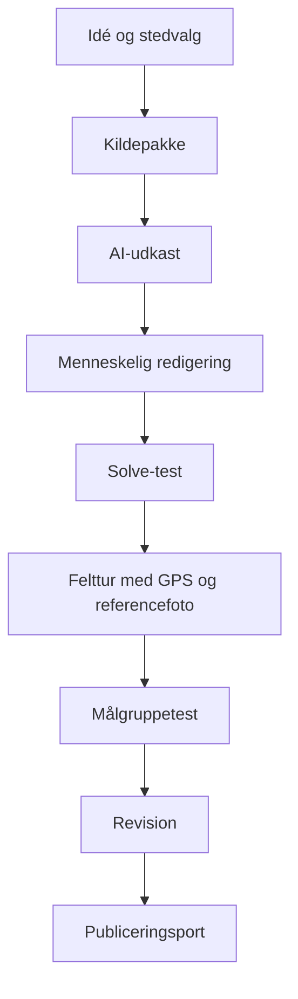
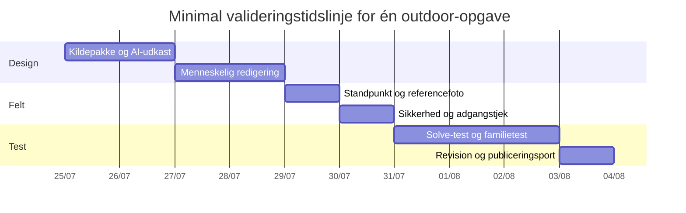
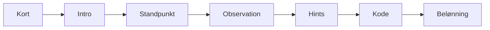

# Retningslinjer for design af opgaver i Byens Hemmeligheder

*Download som Markdown-fil:* [Byens_Hemmeligheder_Retningslinjer_Outdoor_Escape_Opgaver.md](sandbox:/mnt/data/Byens_Hemmeligheder_Retningslinjer_Outdoor_Escape_Opgaver.md)

## Executive summary

Byens Hemmeligheder er i projektmaterialet beskrevet som et gratis, lokationsbaseret spil til iOS og web, hvor det fysiske sted skal være en aktiv del af opgaven, målgruppen primært er 10–15-årige og familier, hints er normale, og AI er assistent frem for automatisk udgiver. Det betyder, at en publicerbar outdoor-opgave skal have et præcist standpunkt, et observerbart spor, en entydig svarregel og et dokumenteret facit. fileciteturn0file0 fileciteturn0file1

Escape-room-litteraturen understøtter samme retning. Nicholson beskriver escape rooms som holdbaserede spil, hvor spillere finder spor, løser gåder og udfører opgaver for at nå et mål. Eukel og Morrell anbefaler en cyklisk proces med design, pilot, evaluering, redesign og re-evaluering. Room2Educ8 og nyere designframeworks fremhæver, at især kognitive puzzles, meta-puzzles og tydelig struktur er afgørende for kvaliteten. citeturn3search0turn2search0turn2search4turn14search3

Den vigtigste metodiske konklusion er, at quizmastere bør bygge outdoor-opgaver på **observerbare invariants**: permanente former, dokumenterede årstal, faste relationer mellem objekter, entydige retninger og andre stabile træk ved stedet. Variable forhold som refleksioner, forbipasserende, events, vegetation, midlertidige skilte og AI-tegnede silhuetter uden menneskelig kontrol bør ikke bære facit. citeturn2search0turn18search1

Rapportens samlede anbefaling er derfor at standardisere seks kerneteknikker i Byens Hemmeligheder: observation, mønstergenkendelse, sekvensering, kontrolleret misdirection, progressive hints og kodegenerering med synlig mapping. AI kan hjælpe stærkt med research, tekst, hintudkast, konsistenskontrol og eksport, men menneskeligt feltarbejde er stadig nødvendigt til standpunkt, referencefotos, risikovurdering, rettighedslog og endelig sign-off. citeturn16search3turn18search1

## Principper og designteori for outdoor-opgaver

God outdoor escape-design begynder med sammenhæng mellem sted, fortælling og regel. Nicholson betoner narrativ forståelse som noget, der øger meningsfuldhed, og nyere escape-room-frameworks beskriver puzzles som strukturer, der organiserer spillerens tænkning og samarbejde. Fortællingen må derfor ikke være pynt; den skal forklare, hvorfor spilleren kigger efter netop dette spor, og hvordan observationen skal læses. citeturn20search0turn14search3

Den mest robuste designregel for quizmastere er enkel: byg opgaven omkring noget, der er permanent, synligt, offentligt tilgængeligt og meningsfuldt i fortællingen. Det er netop derfor Bølgen og Fjordenhus er velegnede referencepunkter. VisitVejle og Henning Larsen beskriver Bølgen som fem bølgende facader på ni etager, og Fjordenhus’ egne sider samt VisitVejle beskriver fire sammenhængende cylindre på 28 meter med to vandgennemstrømmede rum i stueetagen. Det er verificerbare data, som kan omsættes til facit uden gæt. citeturn0search4turn0search3turn1search1turn15search3

I praksis bør quizmasteren altid tænke i tre lag:

| Lag | Funktion | God praksis | Dårlig praksis |
|---|---|---|---|
| Sted | giver observationen | permanent form, antal, retning, inskription | refleksioner, events, mennesker, midlertidige skilte |
| Fortælling | giver motivation og rækkefølge | kort note, brev, lokal karakter, arkitektbesked | lang baggrundstekst uden funktion i gåden |
| Regel | gør facit udledeligt | tydelig mapping, “tæl kun X”, klar rækkefølge | skjulte mellemregler, vilkårlige koder, implicitte antagelser |

Escape-room-litteraturen peger også på, at kvalitet opstår gennem iteration. Eukel og Morrells designcyklus og Veldkamp m.fl.s fokus på boundary conditions og co-creation betyder i denne sammenhæng, at selv gode idéer skal solve-testes, feltverificeres og prøves af på rigtige brugere, før de publiceres. citeturn2search0turn14search1turn16search7

## Kognitive mekanikker, sværhedsgrad og tilgængelighed

Observation, mønstergenkendelse og sekvensering er de tre mest robuste outdoor-mekanikker til Byens Hemmeligheder. Room2Educ8’s opdeling i kognitive, fysiske og meta-puzzles er nyttig her: observation og mønstre er kognitive kernepuzzles; fysisk aktivitet udendørs bør primært forstås som perspektivskift og bevægelse mellem standpunkter; kodegenerering fungerer bedst som meta-puzzle, der samler tidligere delresultater. citeturn2search4turn14search3

Sværhedsgrad bør måles på antallet af mentale trin, graden af regelklarhed og risikoen for plausible forkerte svar — ikke på fysisk fare eller hvor “godt gemt” et spor er. Det passer også med projektets egen sværhedsmodel. For familier og 10–15-årige fungerer niveau 2–3 som standard bedst: én tydelig observation plus én kombinationsregel eller én dokumenteret faktaoplysning fra fortællingen. fileciteturn0file0 fileciteturn0file1

| Niveau | Mentale trin | Egnede mekanikker | Typisk tid |
|---|---|---|---|
| 1 | 1 trin | direkte observation | 1–3 min |
| 2 | 2 trin | observation + enkel regel | 3–6 min |
| 3 | 3 trin | observation + kombination + kode | 5–12 min |
| 4 | 4+ trin | sekvens, flere spor, inventory | 10–20 min |
| 5 | flere lag/steder | meta-puzzle på tværs af lokationer | 15–30+ min |

Tilgængelighed er både fysisk og kognitiv. W3C anbefaler kort og tydeligt sprog, korte tekstblokke, forudsigelig struktur, tydelige labels og hjælp til at finde det vigtigste. Digitaliseringsstyrelsen peger tilsvarende på kontrast, struktureret indhold og mulighed for tekstforstørrelse på web og mobil. For Byens Hemmeligheder betyder det konkret: én hovedregel ad gangen, høj kontrast i UI, store trykflader, præcise hinttekster og tydelige oplysninger om næste handling. citeturn6search0turn6search1turn6search6turn7search2turn7search3turn7search6

Fysiske begrænsninger skal beskrives som metadata i selve opgaven. VisitVejle angiver eksempelvis, at guidede ture i Fjordenhus’ kælder ikke er egnede for gangbesværede og kørestolsbrugere, selv om der er offentlig adgang til stueetagen. Samme sted kan altså være delvist tilgængeligt. Derfor skal hver opgave have egne noter om underlag, trapper, hældning, afstand og pausepunkter. citeturn15search3

## Sikkerhed, tilladelser, medierettigheder og GDPR

Outdoor-opgaver skal designes ud fra, at en digital placering ikke dokumenterer, at stedet er sikkert eller lovligt at bruge. Geocachings officielle retningslinjer er her direkte relevante: følg lokale regler, skaf tilladelse, undgå at tilskynde til indtrængen, skad ikke ejendom eller natur, og indsamle nøjagtige koordinater ved fysisk besøg. citeturn18search1turn18search0

I Vejle kræver opsætning af skilte, QR-koder eller andre installationer på offentlig vej eller fortov tilladelse til råden over vejareal. Både Vejle Kommune og borger.dk beskriver denne proces. Derfor er den driftsmæssigt bedste MVP fortsat “digital-only”, hvor stedet selv er rekvisitten, og hvor quizmasteren ikke skaber et ekstra vedligeholdelseslag med fysisk hardware. citeturn9search0turn9search2

Medierettigheder kræver en særskilt log. Ophavsretsloven fastslår, at bygninger må afbildes frit, mens kunstværker på offentligt tilgængelige steder er underlagt snævrere regler, især hvis værket er hovedmotivet og gengivelsen udnyttes erhvervsmæssigt. Fjordenhus’ egen presseside fastslår desuden, at pressefotos kun må bruges med den angivne kreditering, og VisitVejle angiver fotokreditering på siderne om både Bølgen og Fjordenhus. Derfor bør quizmastere altid registrere fotokilde, licens, kreditering og eventuel udløbsdato. citeturn11search0turn11search1turn21search5turn0search4turn15search3

GDPR bliver relevant, så snart projektet behandler e-mail, profiler, GPS-logs, billeder eller lyd, der kan knyttes til en person. Datatilsynet gør klart, at et billede kan være personoplysning, og at professionel eller kommerciel offentliggørelse af billeder ofte falder inden for reglerne. Derfor bør referencefotos og mockups som udgangspunkt undgå identificerbare personer, og lagring af foto, lyd og lokationsdata bør følge principper om gennemsigtighed og opbevaringsbegrænsning. citeturn12search1turn12search2turn12search5turn12search0

## Valideringsworkflow, hints, scoring og AI versus menneskeligt feltarbejde

Den anbefalede workflow-model er cyklisk: idé, research, udkast, solve-test, feltverifikation, målgruppetest, revision og publicering. Det svarer til Eukel og Morrells metode, og det er også i tråd med outdoor-platformes creator/review-logik og geocaching-guidelines om fysisk koordinatkontrol. citeturn2search0turn18search1



Hints bør følge projektets egen tretrinsmodel: lille skub, konkret hjælp og næsten løsningen. Forskningen om hintstrategier viser, at hintdesign påvirker både gennemførsel og oplevet sværhedsgrad. I Byens Hemmeligheder bør hints derfor være mekaniske og afgrænsende: de skal fortælle, hvad der tæller, hvilken retning der gælder, eller hvilket mellemresultat der allerede er kendt. fileciteturn0file0 citeturn14search0

Scoring bør være forklarlig. Projektets egen pointmodel på 50/75/100/125/150 point og små procentfradrag ved hints er velegnet, fordi den belønner gennemførsel uden at straffe spilleren med tidspres. Den bedste kodegenerering udendørs bruger synlig mapping og tydelig rækkefølge. Hvis spilleren skal lave en kode af flere led, skal fortællingen eller UI’et eksplicit sige, hvordan tallene læses. fileciteturn0file0

| Model | God brug | Styrke | Risiko |
|---|---|---|---|
| Enkelt observationssvar | “Hvor mange?” | meget robust | kan blive for let |
| Observation + faktatekst | antal + dokumenteret fakta | god balance | kan blive trivia |
| Flersporskode | 2–3 delresultater → kode | god escape-room-følelse | tvetydig rækkefølge |
| Meta-kode over flere steder | symboler samles | stærk progression | høj QA-byrde |

AI kan pålideligt lave researchsammenfatninger, tre opgavekoncepter, hintudkast, distraktoridéer, konsistenskontrol, JSON/MD-eksport og UX-copy. Mennesker skal derimod stå for præcis GPS, referencefoto, annoterede konturer, fysisk sikkerhed, tilladelser, medierettigheder, målgruppetest og endelig sign-off. De dele er ikke pynt; de er selve publiceringskvaliteten. citeturn16search3turn18search1



## Teknikbibliotek og færdige referenceopgaver

Dette afsnit giver først et genbrugeligt teknikbibliotek og derefter to referenceopgaver til Bølgen og Fjordenhus med færdig logik, korrekte data, facit og beskrivelser af iOS-oplevelsen. Data er forankret i officielle lokale eller arkitektfaglige kilder og suppleret af geotaggede referencepositioner. citeturn0search4turn0search3turn1search1turn15search3turn13search3turn21search2

| Teknik | Designregel | Bølgen-eksempel | Fjordenhus-eksempel |
|---|---|---|---|
| Observation | tæl kun én klart defineret type element | tæl de fem bølgeformede hoveddele; facit **5** | tæl de fire hovedcylindre; facit **4** |
| Mønstergenkendelse | sammenlign stedet med 3–4 afgrænsede alternativer | vælg roofline med fem bølgetoppe; korrekt valg **C** | vælg volumenmodel med fire tromler; korrekt valg **B** |
| Sekvensering | giv én eksplicit læseregel | “hav → højde → historie” giver **592** | “form → vand → højde” giver **428** |
| Misdirection | brug bløde distraktorer | ignorér master, refleksioner og altaner | ignorér åbninger, glasfelter og gangbro |
| Progressive hints | hvert hint afgrænser mere end det forrige | hint 3 giver 5 + 9 + 2 | hint 3 giver 4 + 2 + 8 |
| Kodegenerering | vis mapping og rækkefølge | kode **592** | kode **428** |


### Bølgen som referenceopgave

**Titel:** Bølgen – Den femte besked  
**Status:** Felttestklar med færdig logik  
**Sværhedsgrad:** 3  
**Type:** Observation og kode  
**Målgruppe:** 10–15 år og familier  
**Varighed:** 5–8 minutter

**Datagrundlag og standpunkt.** VisitVejle beskriver Bølgen som fem bølgende facader på ni etager. VisitVejle beskriver også, at de to første bølger stod færdige før pausen i projektet. Henning Larsen beskriver bygningen som fem ikoniske bølgetoppe ved en offentlig promenade. En geotagget referencelokation på Wikimedia Commons angiver et fotostandpunkt ved **55.710400, 9.560430**, hvor hele bygningen kan ses samlet. citeturn0search4turn0search3turn13search3

**Narrativ intro.**  
“Arkitekten efterlod en note: *Læs huset som hav, højde og historie. Først det, du kan se. Så det, huset rejser sig i luften. Til sidst det, der kom før pausen.*”

**Spillerinstruktion.**  
1. Tæl, hvor mange bølgeformede hoveddele bygningen har.  
2. Brug tallet for, hvor mange etager hver bølge har.  
3. Brug tallet for, hvor mange bølger der stod færdige før pausen.  
4. Indtast tallene i rækkefølgen **hav → højde → historie**.

**Facit:** **592**

**Løsningsbevis.** Bølgen har 5 hoveddele, hver bølge har 9 etager, og 2 bølger stod færdige før pausen. Rækkefølgen er givet i teksten. Derfor er koden **592**. citeturn0search4turn0search3

**Hints.**  
- Hint 1: “Tæl kun de store, hvide bølgeformede hoveddele.”  
- Hint 2: “Det midterste tal handler om etager.”  
- Hint 3: “Du skal bruge 5, 9 og 2.”  

**Pointmodel.** Basepoint 100 med projektets standardfradrag for hints. fileciteturn0file0

**Mock iOS UX-beskrivelse.** Kortskærm → intro med de tre ord *hav*, *højde*, *historie* → opgaveskærm med trecifret inputfelt → korrekt-svar-skærm med forklaring og belønningen **Arkitektens Note**.


### Fjordenhus som referenceopgave

**Titel:** Fjordenhus – Vandets tromler  
**Status:** Felttestklar med færdig logik  
**Sværhedsgrad:** 3  
**Type:** Observation og kode  
**Målgruppe:** 10–15 år og familier  
**Varighed:** 5–8 minutter

**Datagrundlag og standpunkt.** Fjordenhus’ egne sider og VisitVejle beskriver bygningen som fire sammenhængende cylindre på 28 meter med to stueetagerum gennemstrømmet af vand og offentlig adgang via broen fra Havneøen. En geotagget referenceposition på Wikimedia Commons angiver et fotostandpunkt ved **55.706374, 9.554946** med sydlig kigretning mod bygningen. citeturn1search1turn15search3turn21search2

**Narrativ intro.**  
“En note fra havnen siger: *Ignorér åbningerne. Læs huset som form, vand og højde. Først det, der bærer huset. Så det, fjorden får lov at løbe igennem. Til sidst det sidste ciffer i husets højde.*”

**Spillerinstruktion.**  
1. Tæl bygningens hovedcylindre.  
2. Brug tallet for, hvor mange stueetagerum vandet løber gennem.  
3. Brug **det sidste ciffer** i bygningens højde i meter som tredje tal.  
4. Indtast tallene i rækkefølgen **form → vand → højde**.

**Facit:** **428**

**Løsningsbevis.** Fjordenhus består af 4 cylindre, 2 rum gennemstrømmes af vand, og højden er 28 meter, så sidste ciffer er 8. Rækkefølgen er givet af fortællingen. Derfor er koden **428**. citeturn1search1turn15search3

**Hints.**  
- Hint 1: “Du skal ikke tælle vinduer eller åbninger.”  
- Hint 2: “Det andet tal handler om vand i stueetagen.”  
- Hint 3: “Du skal bruge 4, 2 og 8.”  

**Pointmodel.** Basepoint 100 med projektets standardfradrag ved hints. fileciteturn0file0

**Mock iOS UX-beskrivelse.** Kortskærm med aktiv zone før broen → intro med teksten “Ignorér åbningerne” → opgaveskærm med tre små felter *form*, *vand*, *højde* → korrekt-svar-skærm med koden **428** og belønningen **Fjordsegl**.




De to referenceopgaver viser også forskellen i efterbehandlingsbehov. Bølgen kræver relativt lidt efterbehandling, fordi “fem bølger” er et ekstremt stabilt observationstræk. Fjordenhus kræver lidt mere menneskelig kontrol, fordi de fire hovedcylindre lettere kan forveksles med åbninger og andre visuelle detaljer. Begge opgaver er derfor logisk færdige, men skal stadig afsluttes med lokalt referencefoto og sikkerhedscheck før publicering. citeturn18search1turn16search3

## Quizmaster-checkliste, MD-skabelon og integration i Custom GPT

En opgave bør først regnes som publicerbar, når hele nedenstående pakke er samlet. Det matcher projektets eksisterende kvalitetslogik og den bedste tilgængelige praksis fra iterativt escape-room-design, feltverifikation og brugerinddragelse. fileciteturn0file0 fileciteturn0file1 citeturn2search0turn16search3turn18search1

| Leverance | Minimumskrav | AI kan hjælpe | Menneske skal godkende |
|---|---|---|---|
| Præcist standpunkt | GPS, foto, retning, sikker ståflade | nej | ja |
| Højopløselige referencefotos | 3–8 fotos i dagslys | delvist | ja |
| Annoterede konturer | markerede former eller zoner | delvist | ja |
| Entydigt facit | canonical answer + alternativer | ja | ja |
| Step-by-step løsning | alle mellemtrin | ja | ja |
| Distraktorer | plausible, men afviselige | ja | ja |
| Hintsæt | 3 trinvise hints | ja | ja |
| Tilgængelighedsnoter | underlag, trapper, afstand, sigtbarhed | delvist | ja |
| Risikovurdering | trafik, vand, mørke, privat område | nej | ja |
| Tilladelseslog | adgang, grundejer, installationer | nej | ja |
| Medierettighedslog | kilde, licens, kredit, udløb | delvist | ja |
| QA-data | solve-test, felt-test, familietest | delvist | ja |

Den anbefalede Markdown-struktur til quizmastere er:

```md
# [Sted] – [Opgavetitel]

**Status:** Idé | Researchklar | Udkast | Felttestklar | Publiceringsklar
**Sværhedsgrad:** 1-5
**Type:** Observation | Kode | Mønster | Sekvens | Inventory | Meta
**Målgruppe:** 10-15 år / familie
**Varighed:** X minutter
**Facit:** [kanonisk svar]
**Område/historie:** [rute eller område]

## Kort vurdering af stedet
## Datagrundlag og kilder
## Fakta versus fiktion
## Præcist standpunkt
## Narrativ intro
## Spillerinstruktion
## Facit og løsningsbevis
## Alternative accepterede svar
## Typiske forkerte svar og feedback
## Hints
## Point og progression
## iOS UX-flow
## Tilgængelighed
## Sikkerhed
## Medierettigheder
## Tilladelser
## Felttestplan
## Quizmasterens åbne punkter
## Struktureret eksport
```

**Anbefalet filnavn til GPT-vidensfil:** `07_Retningslinjer_Outdoor_Escape_Opgaver.md`

**Hvor filen skal bruges.** Læg den i **Knowledge** sammen med projektgrundlag, quizmastermanual, opgaveskabelon og gold-standard-eksempler. I **Instructions** bør der indsættes en kort henvisning under arbejdsgang eller publiceringsport, så GPT’en altid bruger denne fil som normativ reference, når den designer eller vurderer nye opgaver. fileciteturn0file0 fileciteturn0file1

**Forslag til indsættelsestekst i GPT Instructions:**

```md
## Brug af vidensfilen 07_Retningslinjer_Outdoor_Escape_Opgaver.md

Når du designer eller vurderer en ny opgave, skal du bruge 07_Retningslinjer_Outdoor_Escape_Opgaver.md som din primære metodeguide for:
- kognitive mekanikker
- sværhedsgrad og tilgængelighed
- sikkerhed, tilladelser, medierettigheder og GDPR
- valideringsworkflow og publiceringskrav
- krav til standpunkt, referencefotos, facit, hints og risikovurdering

Hvis en foreslået opgave strider mod disse retningslinjer, skal du stoppe og forklare, hvad der mangler for at opgaven kan blive felttestklar eller publiceringsklar.
```

**Kort startprompt til quizmastere:**

```text
Hjælp mig med at lave en ny Byens Hemmeligheder-opgave.
Sted: [navn]
By/område: [sted]
Målgruppe: [fx 10-15 år og familie]
Ønsket sværhedsgrad: [1-5]
Kilder og fotos: [indsæt]
Brug 07_Retningslinjer_Outdoor_Escape_Opgaver.md aktivt.
Start med at vurdere datagrundlaget, peg på mangler, og foreslå derefter 3 opgavekoncepter.
Vælg det mest robuste og arbejd det frem til mindst Felttestklar status.
```

Den vigtigste praktiske regel for quizmastere er til sidst den enkleste: **Hvis facit ikke kan bevises på papir, kan det ikke publiceres i appen.** For Byens Hemmeligheder er det bedre med en lidt enklere, men vandtæt opgave end med en spektakulær opgave, der kun virker, når forfatteren selv forklarer den. Det princip er fuldt foreneligt med både projektets egne mål og den bedste tilgængelige escape-room-litteratur. fileciteturn0file0 fileciteturn0file1 citeturn2search0turn14search3turn20search0