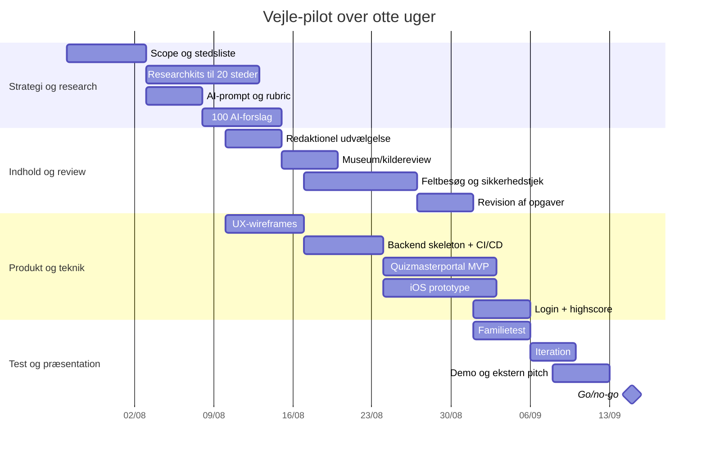

# Byens Hemmeligheder

## Executive summary

Foranalysen peger på, at **Byens Hemmeligheder — Find spor. Løs gåder. Oplev historien.** bør bygge på en kombination af tre gennemprøvede modeller: **Questo** for stærk historiedrevet UX, fleksibel solo-/gruppeafvikling, indholdsreview og creator-economy; **Actionbound** for den bedste reference til et webbaseret værktøj, hvor ikke-tekniske indholdsforfattere bygger GPS-baserede oplevelser med quizzer, medier, QR-koder og testtilstand; og **Natureventyr** som dansk bevis på, at gratis, lokationsbaseret historiefortælling kan få familier ud i naturen i Vejle. **City Escape** viser omvendt, hvad jeres løsning netop ikke skal være i pilotfasen: booking, fast mødested, instruktør og fysisk kuffert. Den klare anbefaling er derfor en **gratis, app-først, indholdsplatform for Vejle**, hvor frivillige quizmastere og kulturpartnere producerer små stedsspecifikke missioner i et redaktionelt workflow med AI-assistance, fysisk sikkerhedstjek og museumsgodkendelse, før indhold publiceres. MVP’en bør fokusere på 10–20 lokationer, e-mail-login med engangskode, GPS-aktivering, hints med meget lille pointfradrag, enkel inventory, offline caching og et quizmaster-webværktøj med preview/test-mode. citeturn1view1turn7view0turn7view1turn1view2turn12view0turn12view1turn1view4turn1view5turn1view6

## Inspirations- og konkurrentbillede

Det vigtigste resultat af markedsscreeningen er, at der **ikke** er én eksisterende platform, som matcher jeres vision direkte. I stedet findes der stærke byggesten på tværs af flere produkter. **Questo** er den nærmeste inspirationskilde til selve spilleroplevelsen, fordi platformen kombinerer gåture, historie, spor, gåder, gruppeplay, fleksibel afvikling og creator-review i stor skala. **Actionbound** er den nærmeste inspirationskilde til den redaktionelle og tekniske indholdsproduktion, fordi deres “Bound Creator” dokumenterer, at ikke-tekniske brugere kan opbygge ruter med GPS, quiztyper, medier og test-QR-koder. **City Escape** dokumenterer efterspørgsel efter outdoor escape-formatet i Vejle, men er samtidigt et stærkt kontrastpunkt, fordi oplevelsen er betalt, tidsstyret og afhængig af fysisk udleveret udstyr. **Natureventyr** beviser, at gratis, lokalt forankrede fortællinger i Vejle allerede fungerer i familieformat. **Geocaching** er den bedste reference for “kort + opdagelse + fri start”, men bør kun inspirere den digitale opdagelseslogik — ikke drift med fysiske beholdere. citeturn1view1turn7view0turn7view1turn1view2turn12view0turn1view4turn1view5turn1view6turn13search2turn13search1

| Platform | Business model | Core features | Content creation workflow | Monetization | Strengths for our project | Weaknesses/risks |
|---|---|---|---|---|---|---|
| **Questo** | Gratis app; quests sælges enkeltvis; quests starter fra €7,99; creators kan tjene op til 75 % royalty share. citeturn1view0turn1view1turn7view1 | Historiedrevne byquests, spor, puzzles, gruppeplay, quest invites, hjælp/hints, XP, fleksibel start, pause/fortsæt, iOS/Android, i 1.000+ byer. citeturn1view1turn14view0turn14view1turn2search20 | Creator builder uden krav om kodning; route + challenges + place stories + fiction; review; public quests testes først; mindst 10 virkelige testspillere før mulig betalt publicering. citeturn7view0turn7view1 | Salg af quests, partner-/reseller-program og creator revenue share. Eksakte API’er er ikke offentligt specificeret. citeturn1view1turn7view1turn14view0 | Bedste reference til jeres **oplevelsesdesign**: stærk narrativ ramme, inviteret multiplayer, hjælpesystem, review og testmode. Også vigtig reference til “frivillige creators + redaktionel kvalitet”. citeturn14view0turn14view1turn7view0turn7view1 | Betalt model matcher ikke jeres gratis vision; quests er primært by-/turistcentrerede; publicering er bundet til Questo-platformen; direkte støtte for dansk institutionsworkflow er uspecificeret. citeturn1view1turn7view1 |
| **Actionbound** | Gratis til privat, ikke-kommerciel brug; EDU- og PRO-licenser for skoler, museer, organisationer og virksomheder; 14 dages trial; testing er gratis. citeturn12view2turn12view3turn8search19 | GPS “Find Spot”, quiztyper, multiple choice, solution input, sortering, cloze, missions med billede/video/audio, surveys, QR/barcodes, maps, compass, tournaments, resultateksport. citeturn1view2turn1view3turn12view0turn12view4turn12view5 | Webbaseret Bound Creator med live preview, test-QR-koder for hele oplevelsen eller enkeltdele, publicering, evaluering og eksport. citeturn8search1turn12view1turn12view0 | Licenser og premium features; white-label/individuelle løsninger nævnes, men præcis funktionspakke afhænger af licens. citeturn12view3 | Bedste reference til jeres **quizmasterportal**: strukturerede elementer, preview, testmode, QR/GPS-kombination og resultater. Viser også hvor langt man kan komme med et no-code-lignende forfatterværktøj. citeturn12view0turn12view1 | Platformen er mere “værktøj” end brandet forbrugeroplevelse; missions kan ikke auto-scores korrekt/forkert; gratis model gælder kun privat brug, så den er ikke en direkte driftsmodel for jer. citeturn12view4turn12view2 |
| **City Escape Vejle** | Betalt booking per person; i Vejle viser prislisten bl.a. 269 DKK for 2 personer og 199 DKK pr. person ved 5+ deltagere. citeturn1view4turn4view0 | Udendørs escape games i Vejle centrum; iPad + kuffert med gadgets; to timers mission; samarbejde og konkurrence; fast meeting point; instruktørintroduktion. citeturn1view4 | Indhold produceres centralt af firmaet; public workflow for eksterne forfattere er ikke beskrevet offentligt. citeturn1view4 | Billetsalg/booking, events, teambuilding, fødselsdag, skole m.m. citeturn1view4 | God reference til “escape room ude i byen” og dokumentation af, at Vejle fungerer som scene for den type oplevelse. citeturn1view4 | Passer dårligt til jeres gratis, skalerbare appmodel, fordi oplevelsen kræver booking, mødested, personale, udstyr og tidsvindue. citeturn1view4turn4view0 |
| **Geocaching** | Freemium: gratis konto/app + premium-medlemskab og premium-funktioner. citeturn13search2turn13search0turn13search6 | Kort over cacher, koordinater, navigation, fysisk cachejagt, hints, sværhedsgrader, offline-lister for premium, community review af nye cacher. citeturn5search0turn5search1turn13search1turn13search6 | Community skaber cacher; cacher indsendes og gennemgår reviewer-proces før publicering. citeturn13search1turn13search19 | Premium-medlemskab og stort community-økosystem. citeturn13search0turn13search6 | Stærk inspiration til kort, opdagerfølelse, status pr. punkt og community review. citeturn5search0turn13search1 | Fysiske beholdere giver vedligehold, tilladelser, risiko for bortkomst og mere drift end jeres pilot bør bære. citeturn5search1turn13search1 |
| **VisitVejle / Natureventyr** | I Vejle er oplevelserne beskrevet som gratis; syv til otte børnevenlige ruter/eventyr i Vejle Kommune. citeturn1view5turn1view6 | App med fortælling ved checkpoints, små opgaver undervejs, familiefokus, ruter i natur og historiske områder. citeturn1view5turn1view6 | Indhold er produceret i samarbejde med Vejle Kommune og Natureventyr; officielt creator-workflow er ikke beskrevet på VisitVejles sider. citeturn1view5turn1view6 | Kommunalt/partnerskabsdrevet; ingen offentlig pris på Vejle-indholdet. citeturn1view5turn1view6 | Vigtig dansk reference for gratis, familievenlig, lokationsbaseret historiefortælling i netop Vejle. citeturn1view5turn1view6 | Målgruppen på Vejle-siderne er yngre børn end jeres 10–15 år; gåderne fremstår lettere og mindre escape-room-drevne. citeturn1view5turn1view6 |

**Konklusionen** er derfor klar: Byens Hemmeligheder bør være **Questo-spilleroplevelse + Actionbound-forfatterværktøj + Natureventyrs lokale familieforankring + Geocachings opdagelseslogik**, men uden City Escapes driftsmæssige tyngde og uden Geocachings afhængighed af fysiske beholdere. citeturn1view1turn7view0turn12view0turn1view4turn1view5turn13search1

## Funktionskortlægning

Nedenstående kortlægning samler de funktioner, der bedst bør adoptere, tilpasse eller bevidst fravælge i Vejle-piloten.

| Feature | Adoptér / tilpas | Begrundelse | Implementeringsnoter | Prioritet |
|---|---|---|---|---|
| **UX med mission + kapitler** | **Adoptér fra Questo, tilpasset Vejle** | Questo viser, at den stærkeste oplevelse er en mission, der binder rute, udfordringer og stedshistorier sammen. citeturn7view0turn1view1 | Hver rute bør have intro, 3–7 kapitler og en enkel finale. Små historier bør også kunne stå alene. | **MVP** |
| **Kort med tydelige punkter** | **Adoptér fra Geocaching/Natureventyr** | Kort, status pr. punkt og fri navigation er centralt i geocaching og naturfortællinger. citeturn5search0turn1view6 | Markører: åben, i nærheden, låst, løst. Kortet må ikke være overfyldt i MVP. | **MVP** |
| **GPS-aktivering** | **Adoptér fra Actionbound/Questo** | Begge platforme bruger GPS til at knytte digitalt indhold til stedet. citeturn1view3turn1view1 | Radius bør være justerbar pr. opgave, fx 20–60 m. Tilføj manuel fallback for GPS-fejl til redaktør/tester. | **MVP** |
| **Hints med lille pointfradrag** | **Adoptér fra Questo, men blødere** | Questo har indbygget help-system, hvor hint koster XP, og fuldt svar fjerner XP for den udfordring. Det understøtter, at hjælp er en normal del af flowet. citeturn14view1 | For jeres projekt bør fradrag være lavt, fx 3 % + 4 % + 5 %. Ingen tidsstraf. | **MVP** |
| **Inventory** | **Tilpas kraftigt** | Inventory findes ikke tydeligt som kernefunktion i de analyserede platforme, men er central for jeres escape room-identitet. Derfor er det et bevidst differentieringspunkt. | Start simpelt: nøgler, kortfragmenter, segl, symboler. Undgå komplekse krydsafhængigheder i pilot. | **Phase2** |
| **Quizmasterportal** | **Adoptér fra Actionbound + Questo creator** | Actionbound dokumenterer stærk skabelse, preview og test; Questo dokumenterer creator-review og public/private/publicering i testmode. citeturn12view1turn8search1turn7view0turn7view1 | Webportal med formularer, kortpicker, preview, testlink og statusflow. Ingen kodekrav til frivillige. | **MVP** |
| **AI-assistent til indholdsproduktion** | **Ny kernefunktion** | De analyserede platforme bygger mennesker ind som forfattere/redaktion. Jeres konkurrencefordel er at lade AI accelerere første udkast, men ikke publicere automatisk. Questo understreger review; Actionbound understreger test. citeturn7view0turn7view1turn12view1 | AI genererer forslag til historie, opgavetyper, hints, svarregler og risici. Menneske godkender altid. | **Phase2** |
| **Pointmodel uden fokus på tid** | **Tilpas** | City Escape og Questo bruger konkurrence/XP, men jeres mål er bevægelse og oplevelse snarere end kapløb. citeturn1view4turn14view1 | Point for gennemførsel, fundne bonusspor og evt. ekstra opgaver; kun lille hintfradrag; tid vises som statistik. | **MVP** |
| **Autentifikation med e-mail engangskode** | **Ny projektbeslutning** | Dette matcher jeres ønske om lav friktion. Det er også lettere at forklare og drifte end flere sociale logins i pilot. | Offentlig profil viser kun valgt navn; e-mail bruges internt. Face ID kan bruges som lokal genåbning på iOS senere. | **MVP** |
| **Offline caching** | **Adoptér** | Questo anbefaler download/start med net men begrænset/forskellig offline-funktion efterfølgende; Actionbound kan downloades og afvikles offline efter forudgående download. Det er særligt relevant for områder uden stabil dækning. citeturn14view1turn2search19turn3search0 | Cache rute, medier, svarregler og kortudsnit på forhånd. Upload forsøg og telemetri, når netværk vender tilbage. | **MVP** |
| **Medietyper** | **Adoptér fra Actionbound/Questo/Natureventyr** | Actionbound understøtter billeder, video, audio og brugeroptagelser; Questo creators kan arbejde med fotos, tekst, audio og GPS-content; Natureventyr viser styrken i oplæsning/fortælling. citeturn12view4turn7view4turn1view5 | MVP: tekst, billede, evt. lyd. Phase2: spillerfoto/lyd, AI-billeder, historiske overlays. | **MVP** for tekst/billede, **Phase2** for lyd/opgaver med upload |
| **QA, preview og test modes** | **Adoptér stærkt** | Questo publicerer i test mode og kræver virkelige spillere; Actionbound har test-QR for hele spil eller enkeltdel. citeturn7view0turn12view1 | Kræv preview som spiller, GPS bypass for testere, publiceringsworkflow og log over ændringer. | **MVP** |

Den vigtigste strategiske beslutning er at gøre **quizmasterportalen og reviewflowet** til en lige så vigtig del af MVP’en som spillerappen. Det er her Dette projekt adskiller sig fra både City Escape og Natureventyr: jeres skalerbarhed afhænger af, at lokale frivillige kan producere sikkert og konsistent indhold uden udviklerhjælp. citeturn1view4turn1view5turn12view1turn7view0

## Produktionsworkflow for indhold

Inspireret af **Questo Creator** og **Actionbound Bound Creator** bør Byens Hemmeligheder have et redaktionelt flow, hvor frivillige kan skabe indhold med lav teknisk barriere, men hvor ingen opgave publiceres uden gennemløb af review, test og sikkerhedstjek. Questo viser et effektivt mønster: byg rute og indhold, submit til review, test i den virkelige verden og publicér først derefter. Actionbound viser den tekniske disciplin omkring preview/test før release. citeturn7view0turn7view1turn12view1turn8search1

Det anbefalede workflow er:

**Trin 1 — Idé og stedvalg.** Quizmaster vælger et sted i Vejle, beskriver kort hvorfor stedet er interessant, og markerer på kortet, hvad spilleren fysisk kan observere. Dette bør tvinge forfatteren til at skrive ud fra stedet, ikke blot ud fra en generisk tekst.

**Trin 2 — Kilder og fakta.** Quizmaster uploader kilder eller indsætter links/noter. Hvis Vejlemuseerne eller andre fagpartnere skal reviewe, bør hvert faktuelt udsagn kunne spores til en kilde eller lokal ekspertvurdering. Dette spejler creator-guides og review-praksis hos Dette og Actionbound, hvor kvalitet og virkelighedstjek er eksplicitte. citeturn7view1turn7view0turn12view1

**Trin 3 — AI-forslag.** AI genererer 3–5 mulige missioner og opgavetyper pr. sted med vanskelighed, hints, svarregel, foreslået inventory-item og risikoflag. AI må kun være assistent; publicering uden menneskelig godkendelse bør være blokeret.

**Trin 4 — Menneskelig redigering.** Quizmaster vælger én retning, skriver fortælling i børne-/familietone, justerer svarregler og fjerner elementer, der ikke sikkert kan ses på stedet.

**Trin 5 — Sikkerheds- og adgangstjek.** Forfatter eller lokal redaktør markerer, om opgaven kan gennemføres fra offentligt tilgængeligt område, om der er trafik, vand, stejle stier eller årstidsproblemer, og om der er behov for fysisk skiltning/tilladelse. Dette er særligt vigtigt, fordi Questo eksplicit fremhæver, at publicerede ruter skal være klare, sikre og værdifulde for spilleren. citeturn7view0turn1view1

**Trin 6 — Preview og intern test.** Portal skal kunne vise oplevelsen som spiller. Testere skal kunne køre ruten med GPS-bypass og markering af præcis, hvor noget fejler. Actionbounds model med test af hele forløbet eller enkelte elementer er et stærkt forbillede her. citeturn12view1

**Trin 7 — Fagligt review.** Historisk følsomme eller centrale opgaver sendes til review hos Vejlemuseerne og eventuelt VisitVejle/lokalarkiv. En let model er “rød/gul/grøn”: grøn = publicerbar, gul = små rettelser, rød = stop.

**Trin 8 — Felttest med rigtige spillere.** Som hos Questo bør publicering i pilot ske via en **teststatus**, hvor rigtige familier/unge prøver ruten, før den åbnes bredt. Questo kræver mindst 10 real-world testspillere på public quests; I behøver ikke kopiere tallet præcist, men princippet er stærkt. citeturn7view0

**Trin 9 — Publicering og versionering.** Når opgaven publiceres, låses en version. Senere ændringer skal oprette ny version, så man altid kan se, hvilken version der gav hvilke spillerresultater.

**Trin 10 — Drift og vedligehold.** Indhold skal have revisionsdato. Hvis en bygning ændrer facade, et skilt fjernes, eller et område spærres, skal opgaven kunne pauses øjeblikkeligt.

Følgende felter bør være obligatoriske i quizmaster-UI’en:

| Felt | Formål | Obligatorisk i MVP |
|---|---|---|
| Titel | Navn på opgave eller kapitel | Ja |
| Område / rute | Samler opgaven i et område eller en historie | Ja |
| Koordinater | Præcis lokation | Ja |
| Radius | GPS-aktiveringsafstand | Ja |
| Sværhedsgrad 1–5 | Spillerforventning og pointniveau | Ja |
| Kort fortælling / intro | Kontekst ved start | Ja |
| Opgavetekst | Selve udfordringen | Ja |
| Svarregel | Korrekt svar, alternativt svar, format, validering | Ja |
| Hints | Mindst 1–3 hints | Ja |
| Inventar-genstand ud | Hvad spilleren får ved løsning | MVP valgfrit |
| Inventar-krav ind | Kræver tidligere genstand? | MVP valgfrit |
| Billeder / illustrationer | Liv og kontekst | Ja |
| Lyd / oplæsning | Tilgængelighed og stemning | Phase2 |
| Sikkerhedsnoter | Trafik, vand, trapper, privat område, dårlig dækning | Ja |
| Kilder / kildehenvisninger | Museal og redaktionel kvalitet | Ja |
| Sæson/gyldighed | Hvis opgaven kun virker dele af året | Phase2 |
| Preview/test-toggle | Test uden normal GPS-lås | Ja |
| Publiceringsstatus | Kladde, review, test, publiceret, pauset | Ja |
| Senest fysisk verificeret | Drift og vedligehold | Ja |

## AI-eksperiment for Vejle

Den største usikkerhed i projektet er ikke frontend, backend eller kortteknologi. Den største usikkerhed er, om AI faktisk kan hjælpe med at producere **gode, lokale, entydige og sikre opgaver** hurtigere end et rent manuelt workflow. Dette er i praksis den samme systemudfordring, som Questo og Actionbound løser med forfatterværktøjer, templates, review og test — men hos jer skal AI ind som et ekstra lag mellem research og redigering. citeturn7view1turn12view1turn8search17

**Forsøgsdesign.** Vælg 20 steder i Vejle fordelt på fire typer: midtby, havn/fjord, natur og kulturhistorie. For hvert sted samles et lille input-kit: navn, koordinater, 2–5 kilder, 4–10 fotos, beskrivelse af synlige elementer, målgruppe 10–15 år/familie, ønsket sværhedsgrad og sikkerhedsnoter. Derefter genererer AI **5 opgaveforslag per sted**, altså **100 forslag i alt**, inspireret af creator-strukturen hos Questo og elementkataloget hos Actionbound. citeturn7view0turn12view0

**Input til AI.**  
Stedets navn og koordinater; historiske/stedlige kilder; billeder fra stedet; synlige fysiske detaljer; type område; ønsket sværhedsgrad; om opgaven skal være observation, kode, sekvens, billedsammenligning eller inventory-baseret; samt sikkerhedsbegrænsninger.

**Output fra AI.**  
Kort historisk pitch; 3–5 narrative vinkler; konkret opgaveidé; svarregel; 1–3 hints; forslag til pointniveau; evt. inventory-item; risikoflag; og anbefaling til, hvad der skal testes ved fysisk besøg.

**Pipeline.**
1. Researchpakke oprettes manuelt.
2. AI genererer råudkast.
3. Redaktør vælger de bedste 1–2 forslag per sted.
4. Historisk/faglig notatkontrol.
5. Fysisk felttjek.
6. Intern app-/papirprototype-test.
7. Spiltest med målgruppen.
8. Revideret version til pilot.

**Målepunkter.**  
Effektivitet, kvalitet og redigerbarhed er vigtigere end “ren AI-magi”. Rapporter derfor: tid brugt pr. sted, andel af forslag der kan reddes, andel af forslag der kræver tung omskrivning, antal steder hvor det fysiske sted faktisk bruges aktivt, og hvor mange forslag der fejler på entydighed eller sikkerhed.

**Go / no-go-kriterier.**
- Mindst **60 %** af de 100 forslag skal være brugbare efter normal redigering.
- Mindst **25 %** skal vurderes som direkte gode eller meget gode.
- Mindst **10 af de 20 steder** skal ende med mindst én opgave, hvor det fysiske sted er nødvendigt for løsningen.
- Mindst **70 %** af de udvalgte testopgaver skal i familietest vurderes som “sjov” eller “meget sjov”.
- Gennemsnitlig menneskelig redigeringstid pr. færdig opgave skal være væsentligt lavere end ved manuel produktion alene.

Den menneskelige reviewrubrik bør være stabil og enkel:

| Kriterium | Skala 1–5 | Hvad der måles |
|---|---|---|
| Lokationsrelevans | 1 = kunne ligge hvor som helst, 5 = kan kun løses her | Bruger opgaven stedet aktivt? |
| Historisk kvalitet | 1 = tynd/uklar, 5 = stærkt og præcist forankret | Er fortællingen fagligt troværdig? |
| Synligt fysisk spor | 1 = næsten usynligt, 5 = klart og sikkert observerbart | Kan spilleren faktisk finde det på stedet? |
| Entydighed | 1 = flere plausible svar, 5 = ét klart svar | Kan svaret valideres sikkert? |
| Underholdningsværdi | 1 = kedelig, 5 = engagerende | Er den interessant at løse? |
| Familiesamarbejde | 1 = alene/teksttung, 5 = flere kan bidrage | Kan voksne og børn hjælpe hinanden? |
| Sværheds-match | 1 = helt forkert niveau, 5 = passer til sat niveau | Rammer opgaven 1–5 markeringen? |
| Hint-egnethed | 1 = svært at hjælpe uden at afsløre, 5 = naturlig trappemodel | Kan der laves gode hints? |
| Sikkerhed | 1 = problematisk, 5 = trygt fra offentlig adgang | Kan den gennemføres sikkert? |
| Teknisk robusthed | 1 = afhænger af ustabile forhold, 5 = driftssikker | Fungerer den året rundt og uden sårbare afhængigheder? |

Dette eksperiment er beslutningsporten for hele projektet. Hvis AI kun producerer generiske gåder, der lige så godt kunne foregå et andet sted, skal man nedtone AI-ambitionen og i stedet investere mere i menneskelig kuratering. Questo og Actionbound er begge stærke på værktøj + review; det er værd at læse som et signal om, at skalerbar kvalitet stadig kræver menneskeligt redaktionsarbejde. citeturn7view0turn7view1turn12view1

## Jura drift og teknisk MVP

I pilotfasen bør den operationelle strategi være **digital først, fysisk let**. Det skyldes både jura, drift og økonomi. Hvis I opsætter fysiske skilte, QR-koder eller andre markører på offentlige arealer, skal tilladelser afklares. Vejle Kommune oplyser, at man skal søge tilladelse til råden over vejareal ved opsætning på offentlig vej og fortov, og borger.dk peger tilsvarende på, at kommunen eller Vejdirektoratet giver tilladelse til råden over vejarealer. Det betyder, at en MVP uden fysiske markører er markant enklere. Samtidig viser Actionbounds QR-guide, at fysisk kodeopsætning også kræver test, udskiftning og vedligehold, især hvis koder distribueres offentligt. citeturn6search3turn6search17turn12view5

På GDPR-siden er e-mail-login med engangskode et fornuftigt pilotvalg, men det er stadig behandling af personoplysninger. Datatilsynet understreger, at der altid skal være et lovligt behandlingsgrundlag for behandling af personoplysninger, og at den dataansvarlige er den part, der bestemmer formål og hjælpemidler. Hvis I senere vil tilbyde direkte konti til børn med samtykke som grundlag i en informationssamfundstjeneste, peger Datatilsynets samtykkevejledning på 16 år som udgangspunkt i Danmark for barnets eget samtykke; under dette kræves forældremyndighedens samtykke, hvis behandlingen baseres på samtykke. Derfor er det klogt, at pilotfasen ikke bygger på separate børnekonti. citeturn6search9turn6search6turn6search0

Den operationelle sikkerhedsliste bør som minimum omfatte: offentlig adgang, trafikale forhold, vand/skrænter, mørke/årstid, dækning/offline-behov, om opgaven kan løses uden at blokere andre besøgende, og om ruten er brugbar for forskellige mobilitetsniveauer. Dette ligger tæt på Questo, som både fremhæver review for “clear, safe, worthwhile experience” og beskriver, at tilgængelighed varierer pr. rute og bør fremgå i beskrivelsen. citeturn7view0turn14view1turn1view1

**Koncis legal/operational checklist til piloten**
- Afklar, om nogen opgaver kræver fysisk opsat QR/skilt eller kan løses rent digitalt. citeturn6search3turn12view5
- Hvis noget opsættes på offentligt vejareal: afklar tilladelse hos rette myndighed. citeturn6search3turn6search17
- Definér dataansvarlig organisation, formål, dataminimering og opbevaringsperiode for e-mail, profilnavn, score og telemetry. citeturn6search6turn6search9
- Opret privatlivspolitik og databehandleraftaler for hosting/telemetri. Datatilsynet er den centrale myndighed på området. citeturn6search1turn6search2
- Undgå direkte børnekonti i pilot; hvis det senere ønskes via samtykke, skal børne-GDPR vurderes særskilt. citeturn6search0
- Gennemfør fysisk sikkerhedstjek og tilgængelighedsnote pr. lokation før publicering. citeturn7view0turn14view1
- Indfør vedligeholdelsesrutine for alle fysiske assets, hvis de bruges: månedligt check, QR-erstatning, pauseknap i CMS. citeturn12view5

Den anbefalede MVP-stack er fortsat stærk og realistisk: **iOS i SwiftUI**, **web i React/Next.js eller Blazor**, **backend i ASP.NET Core**, **database i Azure SQL Database**, **medier i Azure Blob Storage**, **kode og CI/CD i GitHub Actions**. På Azure-siden er den billigste fornuftige kombination til pilot typisk: **Azure Static Web Apps** til webfrontenden, eventuelt med serverless API; alternativt **Azure App Service** hvis I vil have et mere traditionelt .NET API-hostingmønster; **Azure SQL Database serverless** til lav belastning med auto-pause; og **Azure Blob Storage** til billeder og lyd. Microsoft dokumenterer, at Static Web Apps har en Free plan med gratis hosting, SSL og custom domain samt serverless API’er via Azure Functions med 1 million gratis executioner; Azure SQL serverless kan skalere automatisk og pause ved inaktivitet, hvor kun storage faktureres; Blob Storage er pay-as-you-go; og App Service er en fuldt managed PaaS med flere prisniveauer. citeturn11search0turn11search12turn11search2turn11search3turn11search1turn11search9

**Minimal servicepakke til piloten**
- Azure Static Web Apps til quizmasterportal og eventuel webspiller. citeturn11search0turn11search12
- Ét ASP.NET Core API, enten som Functions bag Static Web Apps eller som lille App Service. Eksakt billigste model afhænger af trafikmønster og cold-start tolerance; dette bør verificeres i estimering. citeturn11search0turn11search1
- Azure SQL Database serverless. citeturn11search2
- Azure Blob Storage til billeder, AI-illustrationer og evt. lyd. citeturn11search3
- GitHub Actions til byg/deploy.
- Applikationslogning og simpel telemetry. Eksakt værktøjsvalg kan fastlægges senere.

## Pilotplan for otte uger

Til flyer/pitch og tidlig visualisering bør tre iOS-skærme beskrives meget konkret:

**Skærm A — Kort og missioner i nærheden.** Et Vejle-kort med 6–10 markører, tydelig legend for “åben”, “låst”, “løst” og “bonusspor”, en bundsheet med “Mysteriet ved Fjorden”, distance til næste punkt, og en stor CTA: “Start mission”. Inspirationen kommer fra Geocachings og Natureventyrets klare kortcentralitet kombineret med Questo’s quest-first navigation. citeturn5search0turn1view6turn1view1

**Skærm B — Historiekapitel ved lokation.** Et fuldskærmskort eller billede øverst, derefter en kort scene med fortælling, en AI-illustreret karakter og tre knapper: “Læs op”, “Vis hint”, “Åbn opgave”. Dette samler Natureventyrets fortælling og lydpotentiale med Questo’s kapitelflow og hjælpesystem. citeturn1view5turn14view1turn7view0

**Skærm C — Opgave og belønning.** En escape room-opgave med inputfelt eller multiple choice, lille progressbar, punktvis hinttrappe, pointvisning og inventory-badge nederst. Ved korrekt svar vises “Du fandt Brovagtens Segl”. Dette visualiserer den centrale differentiering fra Natureventyr og almindelige guided walks: stedspecifik problemløsning med let gamification. citeturn12view0turn14view1

Den konkrete pilot bør ikke overambitioneres. En stærk Vejle-pilot er **10–20 lokationer**, **2 sammenhængende minihistorier**, **30–40 opgaver**, **én quizmasterportal**, **én iOS-klient** og eventuelt en enkel webklient, hvis den hjælper test og redaktion. Vejlemuseerne er en oplagt reviewpartner, fordi de samler 10 museer og besøgssteder i Vejle by og Vejle Ådal med fokus på kunst, historie og arkæologi. citeturn10search1turn10search3

Det anbefalede backlog for de første otte uger er:

| Uge | Opgave | Primær owner | Succeskriterium |
|---|---|---|---|
| 1 | Fastlæg pilotmål, målgruppe, indholdsstandard og 20 kandidatsteder | Product lead + historieredaktør | Godkendt scope og stedsliste |
| 1–2 | Researchpakker til 20 steder | Historieredaktør + lokal research | Min. 20 komplette researchkits |
| 2 | Definér AI-promptskabeloner og evalueringsrubrik | AI lead + redaktion | Klar promptpakke og rubric |
| 2–3 | Generér 100 opgaveforslag | AI lead | 100 forslag leveret |
| 3 | Første menneskelige sortering og kildetjek | Redaktion + museum review | Top 20 forslag udvalgt |
| 3–4 | UX-wireframes og de tre pitch-skærme | Design | Godkendt pitch-materiale |
| 4 | Datamodel, API-skitse, repo-struktur, CI/CD | Backend lead | Kørende skeleton i GitHub/Azure |
| 4–5 | Quizmasterportal MVP med preview/test toggle | Web/frontend lead | Indhold kan oprettes og previewes |
| 5 | iOS prototype med kort, GPS-aktivering og opgaveskærm | iOS lead | 1 rute kan afvikles end-to-end |
| 5–6 | Feltbesøg og sikkerhedstjek på top 10 steder | QA + redaktion | 10 steder verificeret |
| 6 | Familietest og målgruppetest | QA + product | Min. 8–12 testpersoner gennemført |
| 6–7 | Revision af indhold, svarregler og hints | Redaktion | 10–15 robuste opgaver klar |
| 7 | Highscore, e-mail-login med engangskode, offentlig profil | Backend + iOS | Basisprofil og score virker |
| 7–8 | Pilotdemo, pitchdeck/flyer og ekstern præsentation | Product + design | Demo klar til VisitVejle/Vejlemuseerne |
| 8 | Go/no-go review | Styregruppe | Beslutning om fortsættelse |

De mest handlingsnære næste skridt er derfor: lås de 20 første steder; kør AI-eksperimentet; byg kun nok portal og app til at teste dem i felten; og gå først videre til bred implementering, når mindst 10–15 opgaver fungerer sikkert og tydeligt i Vejle. Det er den hurtigste vej til at validere, om Byens Hemmeligheder kan blive en skalerbar, gratis oplevelsesplatform — ikke bare en god idé. citeturn7view0turn12view1turn1view5turn10search1

**Analyserede sider med direkte relevans til denne rapport:** Questo for players og FAQ, creator-room og builder-sider, tilsvarende city/creator-sider; Actionbound hovedsite, pricing, features og help-artikler om GPS, testing, missions og QR-koder; City Escape Vejle-siden og officiel prisliste; VisitVejle og Vejle Kommunes Natureventyr-sider; Geocaching officielle how-it-works-, premium- og guideline-sider; Datatilsynets vejledninger om behandlingsgrundlag, roller og samtykke til børn; samt Microsofts officielle sider om Azure Static Web Apps, App Service, Azure SQL serverless og Blob Storage. citeturn1view0turn1view1turn7view0turn7view1turn7view4turn1view2turn12view0turn12view1turn1view3turn12view4turn12view5turn1view4turn4view0turn1view5turn1view6turn13search2turn13search1turn13search6turn6search9turn6search6turn6search0turn11search0turn11search1turn11search2turn11search3