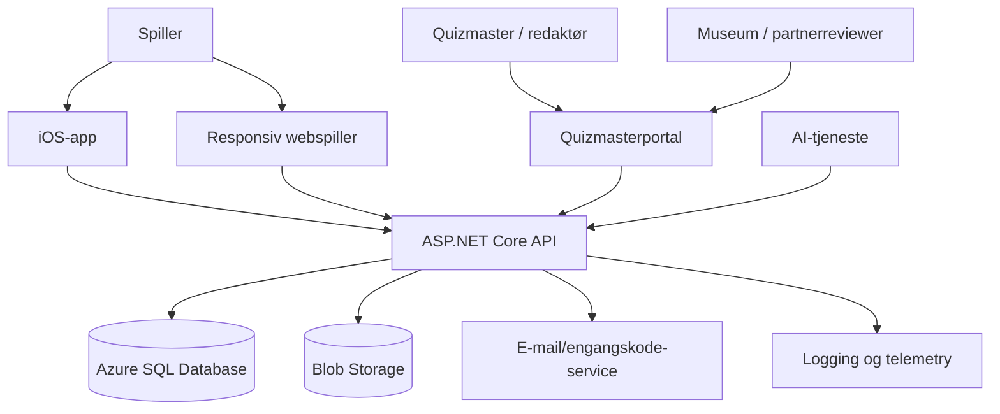

# Byens Hemmeligheder

## Find spor. Løs gåder. Oplev historien.

**Dokumenttype:** Endeligt samlet projektgrundlag  
**Version:** 1.0  
**Dato:** 24. juli 2026  
**Status:** Autoritativt arbejdsdokument til videre validering, partnerdialog og implementering  
**Idé og input:** Jesper Hyldenbrandt Bjerre  
**Primært pilotområde:** Vejle  
**Primær målgruppe:** Børn og unge 10–15 år samt deres familier  

> Dette dokument samler og erstatter de tidligere projektudkast og foranalysen. Det beskriver den fælles produktvision, de fastlagte produktbeslutninger, den anbefalede validering, MVP, indholdsproduktion, tekniske retning og roadmap.

---

## Indholdsfortegnelse

1. Resumé og anbefaling  
2. Fastlagte beslutninger  
3. Vision, formål og positionering  
4. Målgruppe og brugssituationer  
5. Produktkoncept og spillerrejse  
6. Spildesign, opgaver og progression  
7. Informationsarkitektur og centrale skærme  
8. Quizmasterportal og indholdsmodel  
9. Redaktionelt workflow og kvalitetsstyring  
10. AI-strategi og Vejle-eksperiment  
11. Marked, inspiration og differentiering  
12. Vejle-piloten  
13. MVP og prioriteret backlog  
14. Teknisk arkitektur og datamodel  
15. GDPR, sikkerhed, tilgængelighed og rettigheder  
16. Organisation, partnerskaber og drift  
17. Roadmap, leverancer og succeskriterier  
18. Risici og åbne beslutninger  
19. Anbefalede næste skridt  
20. Bilag

---

# 1. Resumé og anbefaling

**Byens Hemmeligheder** er en gratis, lokationsbaseret spil- og formidlingsplatform til iOS og web. Appen skal få børn, unge og familier ud i byen og naturen ved at forvandle virkelige steder til små historiedrevne escape rooms.

Spilleren ser oplevelser på et kort, bevæger sig fysisk til et sted, møder en kort fortælling og løser en gåde, som anvender synlige detaljer på lokationen. Spilleren kan få hints, optjene point, samle digitale genstande og åbne nye kapitler eller områdemysterier.

Projektets særlige værdi er kombinationen af:

- lokalhistorie, natur og byrum
- escape room-gåder og aktiv problemløsning
- fri udforskning og sammenhængende historier
- familieoplevelser med bevægelse som formål
- frivillige quizmastere og kulturpartnere
- AI-assisteret research og opgaveudvikling
- en gratis, digital oplevelse uden booking, udstyr eller fysisk kuffert

Markedsanalysen viser, at grundidéens enkelte elementer er valideret i eksisterende løsninger. **Questo** er den vigtigste inspiration til spilleroplevelsen og de historiedrevne quests. **Actionbound** er den vigtigste inspiration til quizmasterværktøjet, opgavetyper, preview og testtilstand. **Natureventyr** viser, at gratis lokationsbaserede fortællinger kan få familier ud i Vejles natur. **Geocaching** inspirerer kortet, opdagelsesfølelsen og fri start. **City Escape Vejle** viser efterspørgsel efter outdoor escape games, men fungerer samtidig som kontrast til projektets gratis og rent digitale model.

Den overordnede produktretning er derfor:

> **Questo-lignende spilleroplevelse + Actionbound-lignende forfatterværktøj + Natureventyrs lokale familieforankring + Geocachings opdagelseslogik — tilpasset en gratis dansk platform med stærk redaktionel kvalitet.**

Den største projektrisiko er ikke teknologien. Den er, om AI og frivillige sammen kan skabe nok **sjove, entydige, historisk troværdige, sikre og stedsspecifikke opgaver**. Derfor skal projektet gennemføre et kontrolleret AI- og indholdseksperiment, før en stor platform bygges.

Den anbefalede Vejle-pilot er:

- 10–20 fysisk verificerede lokationer
- 2 sammenhængende minihistorier
- 30–40 færdige opgaver
- sværhedsgrad 1–5
- iOS-app og responsiv webspiller
- webbaseret quizmasterportal
- e-mail-login med engangskode
- GPS-aktivering og offline caching
- hints med lille pointfradrag
- simpelt inventory
- highscore med valgt profilnavn
- review, testtilstand og versionsstyring

---

# 2. Fastlagte beslutninger

Følgende beslutninger betragtes som gældende for den videre udvikling, medmindre de ændres eksplicit gennem et senere review.

| Område | Beslutning |
|---|---|
| Navn | **Byens Hemmeligheder** |
| Payoff | **Find spor. Løs gåder. Oplev historien.** |
| Pilot | Vejle og udvalgte områder i Vejle Kommune |
| Målgruppe | Primært 10–15 år; oplevelsen skal fungere for hele familien |
| Pris | Gratis for spillerne i pilot og udgangspunktet for konceptet |
| Platforme | iOS og web; fælles backend |
| Backend | ASP.NET Core og Azure-baseret drift foretrækkes |
| Kerneoplevelse | Historie + fysisk lokation + gåde + progression |
| Opgavekvalitet | De interessante og stedsspecifikke opgaver skal bære oplevelsen |
| Sværhedsgrad | Alle opgaver mærkes 1–5 |
| Hints | Op til tre trinvise hints med et lille pointfradrag |
| Tid | Måles som statistik, men er ikke afgørende for point |
| Identifikation | E-mail med engangskode som første loginmetode |
| iOS-biometri | Face ID/Touch ID kan genåbne en eksisterende session; biometri erstatter ikke backend-identiteten |
| Offentlig profil | Kun brugerens valgte profilnavn vises på highscorelister |
| Børnekonti | Ingen særskilte børnekonti i piloten |
| Formelle hold | Ingen holdmodel, holdkonti eller hold-highscore i første version |
| Fælles spil | Familier og venner kan spille sammen omkring én telefon uden en særlig holdkonto |
| Fair play | Ingen omfattende antisnydeløsning; det accepteres, at nogen kan kende svar fra tidligere ture |
| Variation | Varianter kan senere øge genspilningsværdien |
| Fysiske rekvisitter | Ikke nødvendige; stedet er rekvisitten. QR/NFC/skilte er kun senere muligheder |
| AI | Assistent til research og udkast — aldrig automatisk udgiver |
| Publicering | Kræver menneskelig redigering, felttest, sikkerhedstjek og relevant fagligt review |

---

# 3. Vision, formål og positionering

## 3.1 Vision

> At få børn, unge og familier ud i naturen og byen gennem gratis, lokationsbaserede escape room-historier, der gør lokalhistorie levende.

Byens Hemmeligheder skal gøre virkelige steder til en del af et digitalt spilunivers. Historie, natur, arkitektur og lokale fortællinger skal ikke blot læses, men opleves og bruges aktivt i gåder.

## 3.2 Elevator pitch

> Byens Hemmeligheder gør byen og naturen til et stort, gratis escape room. Familier bevæger sig mellem virkelige steder, finder spor, løser gåder, samler genstande og oplever lokalhistorien gennem en app.

## 3.3 Formål

Projektet skal:

- få børn, unge og familier til at bevæge sig mere
- skabe nye grunde til at besøge lokale by- og naturområder
- gøre lokalhistorie interessant, konkret og tilgængelig
- skabe fælles oplevelser på tværs af alder
- give museer, turistaktører, skoler og frivillige en ny formidlingsplatform
- gøre lokal indholdsproduktion billigere og mere skalerbar
- undersøge AI som værktøj til research, fortælling og opgaveudvikling
- skabe et koncept, som senere kan anvendes i andre byer

## 3.4 Produktløfte

Spilleren skal efter en gennemført tur kunne sige:

- “Vi opdagede et sted, vi normalt bare går forbi.”
- “Vi var nødt til at kigge på virkeligheden for at løse gåden.”
- “Historien gjorde stedet mere spændende.”
- “Alle i familien kunne bidrage.”
- “Vi vil gerne prøve en ny historie.”

## 3.5 Positionering

Byens Hemmeligheder er ikke en digital turistbrochure med quizspørgsmål bagefter. Det er heller ikke et klassisk escape room flyttet udendørs med udleveret udstyr.

Produktet positioneres som:

> **En gratis, lokalt forankret oplevelsesplatform, hvor virkelige steder bliver spilbare gennem fortælling, spor og gåder.**

---

# 4. Målgruppe og brugssituationer

## 4.1 Primær målgruppe

Den primære målgruppe er børn og unge fra **10 til 15 år**. Sprog, interaktion og udfordringer skal være forståelige og motiverende uden at blive barnlige.

## 4.2 Familieoplevelsen

Hele familien er den reelle brugsenhed. Opgaver bør derfor variere, så forskellige deltagere kan bidrage:

- børn opdager farver, symboler og fysiske detaljer
- unge løser koder, mønstre og digitale opgaver
- voksne bidrager med logik, læsning og historisk perspektiv
- flere personer observerer forskellige dele af stedet
- løsningen findes gennem samtale frem for fart

Der etableres ikke en formel holdkonto. En familie kan spille sammen på én enhed, mens point og historik tilknyttes den bruger, der er logget ind.

## 4.3 Sekundære målgrupper

- skoleklasser og SFO’er
- ungdomsklubber
- spejdere og foreninger
- bedsteforældre med børnebørn
- lokale historieinteresserede
- danske og internationale turister
- biblioteker og kulturinstitutioner
- private grupper og senere eventuelt virksomheder

## 4.4 Typiske brugssituationer

1. **Spontan tur:** En familie åbner kortet og vælger en opgave i nærheden.
2. **Planlagt historie:** Familien downloader en rute hjemmefra og gennemfører den i weekenden.
3. **Ferieoplevelse:** En turist vælger en 60–90 minutters introduktion til Vejle.
4. **Skoleforløb:** En lærer deler en privat eller tidsbegrænset rute.
5. **Lokal udforskning:** En beboer samler alle hemmeligheder i sit område over flere ture.

---

# 5. Produktkoncept og spillerrejse

## 5.1 Tre spilleformer

### Fri udforskning

Spilleren vælger frit blandt åbne opgaver og små historier på kortet. Denne form skal gøre det let at starte hvor som helst og understøtter korte ture.

### Historierute

Spilleren følger en anbefalet rækkefølge med intro, 3–7 kapitler og en finale. Hvert sted giver en ny del af historien.

### Områdemysterium

Flere selvstændige opgaver i et område giver symboler, spor eller inventory-genstande, der tilsammen åbner en større afslutning. Dette giver progression uden at kræve, at alle starter samme sted.

## 5.2 Grundlæggende spillerrejse

1. Spilleren åbner appen eller webspilleren.
2. Kortet viser oplevelser i nærheden.
3. Spilleren vælger en mission og ser distance, varighed, sværhedsgrad, tilgængelighed og tema.
4. Oplevelsen downloades til offline brug.
5. Spilleren bevæger sig til første lokation.
6. GPS åbner fortællingen inden for en konfigurerbar radius.
7. En historisk eller fiktiv karakter introducerer situationen.
8. Spilleren undersøger det fysiske sted.
9. Spilleren indtaster et svar, vælger en mulighed eller løser en anden opgavetype.
10. Ved behov anvendes et eller flere hints.
11. Korrekt svar giver point, historiefremdrift og eventuelt en genstand.
12. Spilleren fortsætter, pauser eller vælger en anden åben opgave.
13. Efter turen vises resultater, bevægelse, fund og næste mulige oplevelse.

## 5.3 Centrale designprincipper

### Stedet skal være nødvendigt

> Det fysiske sted skal være en aktiv del af opgaven og ikke blot et GPS-checkpoint.

En stærk opgave kræver typisk, at spilleren aflæser, tæller, sammenligner, orienterer sig eller kombinerer lokale observationer. En opgave, som lige så godt kan løses hjemmefra, er svagere og bør kun bruges som variation eller overgang.

### Opgaven skal bære oplevelsen

Navigation og historie skaber ramme, men gådens kvalitet afgør, om oplevelsen er engagerende. Hver lokation skal derfor begrundes både historisk og spilmekanisk.

### Telefonen skal føre blikket tilbage til stedet

Teksten skal være kort, trykflader store og skærmtiden begrænset. Appen skal jævnligt bede spilleren lægge mærke til omgivelserne i stedet for at stirre på skærmen.

### Ingen tidspres i trafikken

Spillet må ikke belønne farlig fart. Tid registreres kun som personlig statistik.

### Hjælp er en del af spillet

Hints skal normaliseres og hjælpe spillerne videre uden nævneværdig demotivation.

---

# 6. Spildesign, opgaver og progression

## 6.1 Historiefortælling

Historier kan være:

- historisk dokumenterede
- inspireret af faktiske begivenheder
- fiktive fortællinger i en historisk ramme
- lokale mysterier og personfortællinger
- naturhistorier og landskabseventyr
- fortællinger, der forbinder fortid og nutid

Fortællingen skal være kort nok til telefonbrug. Længere stof kan lægges som valgfrit “Læs mere”. Historisk fakta og fiktion skal være tydeligt adskilt.

AI-genererede illustrationer kan give liv til karakterer og fortidsscener, eksempelvis en brovagt, fabriksarbejder eller handelsrejsende. Illustrationer skal mærkes, og deres historiske udtryk skal kvalitetssikres.

## 6.2 Opgavetyper

| Type | Eksempler | MVP |
|---|---|---:|
| Observation | Årstal, navn, symbol, farve, antal, retning eller bygningsdetalje | Ja |
| Kode | Tal-, bogstav-, symbol- eller rækkefølgekode | Ja |
| Multiple choice | Vælg korrekt observation eller forklaring | Ja |
| Historisk før/nu | Sammenlign gammelt billede med nutiden | Ja |
| Logik | Mønstre, eliminering og kombination af spor | Ja |
| Sekvens/sortering | Placér hændelser eller symboler i rækkefølge | Ja |
| Inventory | Brug eller kombinér en digital genstand | Enkel version |
| Kompas/retning | Find en retning eller udsigt | Sen MVP / fase 2 |
| Kamera | Find eller dokumentér et motiv | Fase 2 |
| Lyd/video | Lyt, optag eller se en scene | Fase 2 |
| QR/NFC | Find fysisk markeret punkt | Ikke nødvendigt i pilot |
| AR/historisk overlay | Placér fortiden oven på nutiden | Senere |

## 6.3 Sværhedsgrad 1–5

| Niveau | Beskrivelse | Typisk opgave |
|---|---|---|
| 1 | Meget let | Direkte observation eller enkelt valg |
| 2 | Let | Observation kombineret med kort tekst |
| 3 | Middel | Flere spor kombineres til et svar |
| 4 | Svær | Flere trin, kode, logik eller inventory |
| 5 | Ekspert | Kompleks sammenhæng på tværs af spor eller steder |

Sværhedsgraden beskriver den mentale udfordring, ikke risikoen eller den fysiske tilgængelighed. Tilgængelighed beskrives separat.

## 6.4 Hints

En opgave kan have tre trinvise hints:

1. **Lille skub:** Peger i den rigtige retning.
2. **Konkret hjælp:** Fortæller, hvad spilleren skal undersøge.
3. **Næsten løsningen:** Forklarer metoden uden nødvendigvis at give svaret.

Standardfradrag:

- Hint 1: minus 3 %
- Hint 2: yderligere minus 4 %
- Hint 3: yderligere minus 5 %

En spiller, der bruger alle hints, beholder dermed 88 % af grundpointene. Procentsatserne skal være konfigurerbare.

## 6.5 Point og scoring

Forslag til grundpoint:

| Sværhedsgrad | Grundpoint |
|---|---:|
| 1 | 50 |
| 2 | 75 |
| 3 | 100 |
| 4 | 125 |
| 5 | 150 |

Yderligere point kan gives for:

- frivillige bonusspor
- skjulte genstande
- gennemført historie
- fuldført område
- sæsonopgaver

Point skal gemmes som forklarlige transaktioner, eksempelvis “+100 løst opgave” og “-3 hint 1”. Highscore er sekundær i forhold til oplevelse og bevægelse.

## 6.6 Tid og bevægelse

Efter en tur kan appen vise:

- varighed
- distance
- antal besøgte steder
- antal løste opgaver
- antal anvendte hints
- antal fundne hemmeligheder
- eventuelt skridt, hvis brugeren giver adgang

Tid må ikke have væsentlig pointmæssig betydning.

## 6.7 Inventory

Inventory er et vigtigt differentieringspunkt fra almindelige natur- og byvandringer. Det skal dog starte enkelt.

Mulige genstande:

- nøgle
- kortfragment
- segl
- fotografi
- brev
- mønt
- kodebog
- symbol eller våbenskjold

I piloten bør genstande primært åbne det næste kapitel eller give en tydelig belønning. Komplekse afhængighedsnet og mange mulige slutninger udskydes.

## 6.8 Gamification og highscore

Mulige highscorelister:

- bedste resultater i et område
- ugens spillere
- flest gennemførte historier
- flest besøgte lokationer
- flest fundne hemmeligheder
- lokal Vejle-highscore
- sæsonbaseret highscore

Andre elementer:

- badges og områdemedaljer
- samlinger og dagbog
- skjulte achievements
- kort over gennemførte områder
- sæsonmysterier

Kun det valgte profilnavn vises offentligt. Der er ingen hold-highscore i første version.

## 6.9 Fair play

Det accepteres, at spillere kan kende løsninger fra tidligere ture eller fra andre. Projektet skal ikke udvikle et omfattende antisnydesystem. Målet er at få folk ud og give dem en god oplevelse, ikke at beskytte en konkurrenceturnering.

Senere kan et lille bibliotek af alternative opgaver pr. lokation give variation og genspilningsværdi.

---

# 7. Informationsarkitektur og centrale skærme

## 7.1 Spillerapp og webspiller

Foreslået hovednavigation:

1. **Udforsk** — kort og liste over oplevelser
2. **Mine historier** — aktive, downloadede og gennemførte historier
3. **Inventory** — indsamlede spor og genstande
4. **Resultater** — achievements, statistik og highscore
5. **Profil** — navn, privatliv og login

## 7.2 Kort og markørstatus

- **Åben:** Kan startes nu
- **I nærheden:** Kort gåafstand
- **Låst:** Kræver et kapitel eller en genstand
- **Gennemført:** Allerede løst
- **Mystisk:** Skjult indtil spilleren kommer tættere på
- **Bonusspor:** Valgfri opgave
- **Sæson:** Kun aktiv i en periode

Kortet skal være enkelt og filtrerbart efter område, varighed, sværhedsgrad, tema og tilgængelighed.

## 7.3 Tre centrale pitch- og prototypeskærme

### A. Kort og missioner i nærheden

Et Vejle-kort med 6–10 markører, statusforklaring, en valgt mission i et bundpanel, afstand, forventet varighed og en tydelig knap: **Start mission**.

### B. Historiekapitel ved lokationen

Billede eller illustration, kort fortælling, eventuel oplæsning og knapperne **Åbn opgave** og **Vis hint**. Det skal være tydeligt, hvad spilleren skal kigge efter i virkeligheden.

### C. Opgave og belønning

Opgavetekst, svarfelt eller valg, hinttrappe, point og progression. Ved korrekt svar vises eksempelvis: **Du fandt Brovagtens segl**.

## 7.4 Supplerende skærme

- onboarding og tilladelser
- login med e-mail-engangskode
- missionens detaljer
- download/offline-status
- korrekt og forkert svar
- inventory-detalje
- resultat efter tur
- highscore
- profil og privatliv
- historisk før/nu-visning
- quizmaster-preview

Designet skal have høj kontrast, store trykflader, kort tekst og fungere i sollys samt under bevægelse.

---

# 8. Quizmasterportal og indholdsmodel

## 8.1 Formål

Quizmasterportalen er lige så vigtig som spilleroplevelsen. Platformens skalerbarhed afhænger af, at ikke-tekniske frivillige og kulturmedarbejdere kan skabe og vedligeholde indhold uden udviklerhjælp.

## 8.2 Roller

| Rolle | Ansvar |
|---|---|
| Quizmaster | Researcher og opretter udkast til historier og opgaver |
| Redaktør | Sikrer tone, spilflow, svarregler og konsistens |
| Historisk reviewer | Faktatjekker kilder og historiske påstande |
| Sikkerhedsreviewer | Kontrollerer sted, adgang og fysisk risiko |
| Tester | Afprøver opgaven i preview og på lokationen |
| Administrator | Styrer brugere, områder, rettigheder og publicering |
| Partnerorganisation | Bidrager med kilder, review og kuraterede samlinger |

En person kan have flere roller i piloten.

## 8.3 Portalens hovedområder

- dashboard med status og opgaver, der kræver handling
- områder og lokationer på kort
- historier, kapitler og rækkefølge
- opgaver og svarregler
- hints og point
- media og kildearkiv
- AI-assistent
- preview og testtilstand
- reviewkø og kommentarer
- publicering, versioner og pausefunktion
- driftsoverblik og fejlmeldinger

## 8.4 Obligatoriske felter pr. opgave

| Felt | Formål | MVP |
|---|---|---:|
| Titel | Internt og spillerrettet navn | Ja |
| Område og historie | Placering i indholdsstrukturen | Ja |
| Koordinater | Stedets position | Ja |
| Aktiveringsradius | Typisk 20–60 meter | Ja |
| Sværhedsgrad 1–5 | Forventningsafstemning og point | Ja |
| Kort fortælling | Kontekst før opgaven | Ja |
| Opgavetekst | Selve udfordringen | Ja |
| Svarregel | Korrekt og accepterede alternative svar | Ja |
| Hints | 1–3 trin | Ja |
| Point | Grundpoint og bonusser | Ja |
| Inventory ud/ind | Genstand, som gives eller kræves | Enkel/valgfri |
| Billede/illustration | Formidling og stemning | Ja |
| Kilder | Sporbarhed og faktatjek | Ja |
| Sikkerhedsnoter | Trafik, vand, adgang, mørke m.m. | Ja |
| Tilgængelighed | Underlag, trapper, længde og alternativer | Ja |
| Gyldighed/sæson | Om opgaven virker året rundt | Senere |
| Publiceringsstatus | Kladde, review, test, publiceret, pauset | Ja |
| Senest fysisk verificeret | Vedligeholdelsesdato | Ja |

## 8.5 Indholdsstruktur

```text
Område
└── Historie eller åben samling
    ├── Kapitel / lokation
    │   ├── Fortælling
    │   ├── Opgave
    │   ├── Svarregel
    │   ├── Hints
    │   ├── Point
    │   └── Inventory-belønning
    └── Finale eller områdemysterium
```

Indholdet versionsstyres, så aktive spillere kan afslutte den version, de startede på, og resultater kan forklares efter senere rettelser.

---

# 9. Redaktionelt workflow og kvalitetsstyring

## 9.1 Workflow fra idé til drift

```mermaid
flowchart LR
    A[Idé og stedvalg] --> B[Kilder og researchpakke]
    B --> C[AI-forslag]
    C --> D[Quizmaster-redigering]
    D --> E[Historisk review]
    E --> F[Sikkerheds- og adgangstjek]
    F --> G[Preview og intern test]
    G --> H[Felttest med målgruppen]
    H --> I[Godkendelse og publicering]
    I --> J[Overvågning og periodisk genkontrol]
```



### 1. Idé og stedvalg

Quizmasteren beskriver, hvorfor stedet er interessant, og hvilke fysiske detaljer spilleren kan observere.

### 2. Kilder og researchpakke

Der tilføjes officielle kilder, lokalarkivmateriale, aktuelle fotos, historiske billeder og konkrete sikkerhedsforhold.

### 3. AI-forslag

AI genererer alternative fortællinger, opgavetyper, hints, svarregler, sværhedsgrad og risikoflag. AI-output er altid et udkast.

### 4. Quizmaster- og redaktørarbejde

En person vælger den stærkeste retning, forkorter teksten og sikrer, at opgaven kun kan løses på stedet.

### 5. Historisk review

Faktuelle udsagn og billedbrug kontrolleres. En enkel grøn/gul/rød-status kan anvendes.

### 6. Sikkerheds- og adgangstjek

Stedet kontrolleres fysisk. Opgaven må ikke lokke brugere ind på privat område eller skabe farlig adfærd.

### 7. Preview og intern test

Portalen skal kunne vise hele spillerflowet. Testere kan omgå GPS og teste enkelte elementer.

### 8. Felttest

Opgaven afprøves af rigtige brugere, gerne både 10–15-årige og familier. Feedback registreres på præcise trin.

### 9. Publicering og versionering

En godkendt version publiceres. Senere ændringer skaber en ny version.

### 10. Drift

Opgaven har en ejer og en genkontroldato. Den kan pauses øjeblikkeligt ved ændringer på stedet.

## 9.2 Kvalitetsrubrik

Hver opgave vurderes på en skala fra 1 til 5:

| Kriterium | 1 | 5 |
|---|---|---|
| Lokationsrelevans | Kunne ligge hvor som helst | Kan kun løses netop her |
| Historisk kvalitet | Tynd eller usikker | Præcis og troværdigt forankret |
| Synligt fysisk spor | Svært eller ustabilt at se | Klart og robust observerbart |
| Entydighed | Flere rimelige svar | Ét klart validerbart svar |
| Underholdningsværdi | Føles som skolequiz | Engagerende escape room-gåde |
| Familiesamarbejde | Én person læser alt | Flere kan bidrage naturligt |
| Sværheds-match | Forkert niveau | Passer til mærkning 1–5 |
| Hint-egnethed | Hjælp afslører alt | Naturlig trappemodel |
| Sikkerhed | Kræver risikoadfærd | Tryg fra offentlig adgang |
| Teknisk robusthed | Afhænger af ustabile forhold | Fungerer stabilt året rundt |

Opgaver bør ikke publiceres med kritiske scorer under 3. Lokationsrelevans, entydighed og sikkerhed bør være mindst 4 i piloten.

---

# 10. AI-strategi og Vejle-eksperiment

## 10.1 Den centrale hypotese

> Kan AI finde interessante steder og historier og omsætte synlige fysiske detaljer til gode, sikre og entydige escape room-opgaver hurtigere end et rent manuelt workflow?

AI skal vurderes som produktionsværktøj, ikke som demonstration. Det afgørende er, hvor meget godt redaktionelt arbejde den sparer.

## 10.2 Hvad AI kan hjælpe med

- foreslå relevante steder i et område
- opsummere kilder og markere usikre påstande
- identificere mulige fortællingsvinkler
- foreslå opgavetyper og koder
- generere tretrins-hints
- foreslå alternative svar og valideringsregler
- vurdere en foreløbig sværhedsgrad
- foreslå inventory og progression
- forbinde steder i en større historie
- foreslå målgruppetilpasninger og oversættelser
- formulere billedprompts og oplæsningstekst
- markere sikkerheds- og robusthedsrisici

AI må ikke:

- publicere uden godkendelse
- opfinde historiske fakta, der præsenteres som sande
- erstatte fysisk besigtigelse
- afgøre sikkerhed alene
- anvende materiale uden afklarede rettigheder

## 10.3 Forsøgsdesign

Vælg 20 steder fordelt på:

- 5 i Vejle midtby
- 5 ved havnen og fjorden
- 5 i naturen
- 5 med en stærk kulturhistorisk fortælling

For hvert sted udarbejdes et researchkit med:

- navn og koordinater
- 2–5 troværdige kilder
- 4–10 aktuelle fotos
- relevante historiske fotos, når rettigheder er afklaret
- synlige fysiske detaljer
- målgruppe og ønsket sværhedsgrad
- forventet varighed
- adgangs- og sikkerhedsnoter

AI genererer **5 opgaveforslag pr. sted**, i alt **100 forslag**.

## 10.4 Krævet AI-output

For hvert forslag:

1. kort historisk resumé med kildehenvisninger
2. narrativ vinkel og karakter
3. konkret fysisk observation
4. opgavetekst
5. opgavetype
6. korrekt og alternative svar
7. tre hints
8. foreslået sværhedsgrad
9. point og eventuel inventory-belønning
10. kobling til en større historie
11. risici og usikre antagelser
12. punkter, der skal kontrolleres fysisk

## 10.5 Evalueringspipeline

1. Researchpakke oprettes.
2. AI genererer fem forslag.
3. Redaktør scorer alle forslag.
4. De bedste 1–2 pr. sted udvælges.
5. Historisk og juridisk kontrol udføres.
6. Stedet besøges og opgaven rettes.
7. Opgaven testes i en papir- eller klikbar prototype.
8. Målgruppen gennemfører den.
9. Produktionstid og kvalitet sammenlignes med manuelt arbejde.

## 10.6 Go/no-go-kriterier

Projektet går videre til fuld MVP, hvis:

- mindst 60 % af forslagene er brugbare efter normal redigering
- mindst 25 % er gode eller meget gode
- mindst 10 af de 20 steder giver en opgave, der kræver stedet aktivt
- mindst 70 % af de udvalgte testopgaver vurderes som sjove eller meget sjove
- den menneskelige redigeringstid er mærkbart lavere end ved manuel produktion
- frivillige kan forstå og anvende processen
- historiske fejl og sikkerhedsproblemer opdages før publicering

Hvis AI primært producerer generiske gåder, nedskaleres AI-ambitionen. Produktet kan stadig være værdifuldt, men produktionen skal i højere grad baseres på menneskelige quizmastere, templates og redaktion.

---

# 11. Marked, inspiration og differentiering

## 11.1 Sammenligning

| Løsning | Stærkeste inspiration | Det vi ikke kopierer |
|---|---|---|
| **Questo** | Historiedrevne quests, fleksibel start, pause/fortsæt, hjælp, creator-review og test med rigtige spillere | Betaling pr. quest, global turistprioritering og direkte kopiering af univers eller UX |
| **Actionbound** | Webbaseret creator, mange opgavetyper, GPS, media, live preview og test af enkelte elementer | Et generelt værktøjspræg uden en stærk samlet forbrugeroplevelse |
| **Natureventyr** | Gratis familieoplevelser, lokal/naturbaseret fortælling og checkpoints i Vejle | Primært yngre målgruppe og lettere fortællingsopgaver uden stærk escape room-mekanik |
| **Geocaching** | Kort, fri opdagelse, status pr. sted, sværhedsgrader og community-review | Afhængighed af fysiske beholdere og den vedligeholdelse, de kræver |
| **City Escape Vejle** | Dokumentation af interesse for outdoor escape games og værdien af en samlet mission | Booking, fast mødetid, instruktør, iPad, kuffert og rekvisitter |

## 11.2 Hvad der adopteres

- missioner med kapitler og finale
- kortbaseret opdagelse
- fleksibel start og mulighed for pause
- GPS-aktivering
- download/offline-tolerance
- tretrins-hints
- struktureret creatorværktøj
- preview og testtilstand
- menneskeligt review før publicering
- løbende vurdering og vedligehold

## 11.3 Hvad der tilpasses

- point uden tidspres
- fælles familiespil uden holdkonti
- meget lille hintstraf
- gratis lokal model
- frivillige creators med kulturfagligt review
- enkelt inventory som escape room-identitet
- åbne opgaver, der kan startes flere steder

## 11.4 Differentiering

Byens Hemmeligheder differentierer sig gennem:

1. **Stedspecifik escape room-kvalitet** frem for almindelige quizspørgsmål.
2. **Gratis adgang** og lav startbarriere.
3. **Lokal dansk forankring** med museer, arkiver og frivillige.
4. **Åbne områder og historieruter** i samme platform.
5. **AI-assisteret indholdsproduktion** under menneskelig kontrol.
6. **Aldersbro mellem 10–15-årige og voksne**.
7. **Rent digital drift**, hvor stedet selv er rekvisitten.

---

# 12. Vejle-piloten

## 12.1 Hvorfor Vejle

Vejle kombinerer på et relativt kompakt geografisk område:

- middelalder- og byhistorie
- industri- og arbejderhistorie
- moderne arkitektur og kunst
- havn, fjord, å og skov
- Vejle Ådal
- vikingetid og Jelling
- bronzealder og Egtvedpigen
- museer, arkiver og aktive turistaktører
- bydele og landsbyer med lokale historier

Området giver dermed både let tilgængelige byopgaver og længere naturoplevelser.

## 12.2 Anbefalet pilotscope

- 10–20 lokationer
- 2 minihistorier med 3–7 kapitler hver
- 30–40 opgaver inklusive bonusspor og varianter
- 10–15 opgaver fysisk og målgruppemæssigt kvalitetssikret før ekstern demo
- ét samlet områdekort
- dansk indhold; oversættelse er senere
- én webbaseret quizmasterportal
- responsiv webspiller og iOS TestFlight-app
- 8–12 tidlige testpersoner og derefter en større pilotgruppe

## 12.3 Anbefalet første stedspulje

Følgende 20 kandidatsteder giver variation og er egnede til første researchrunde. De er ikke endeligt godkendt og kræver kilder, fysisk besigtigelse og sikkerhedsvurdering.

### Midtby og industri

1. Vejle Rådhus og Rådhustorvet
2. Sct. Nicolai Kirke
3. Vejle Å og udvalgte broer
4. Den Smidtske Gård
5. Spinderihallerne/Kulturmuseet

### Havn og fjord

6. Fjordenhus fra et lovligt offentligt udsigtspunkt
7. Bølgen
8. Vejle Havn og havnefrontens udvikling
9. Lystbådehavnen
10. Et sikkert udsigtspunkt mod Vejle Fjordbroen

### Natur og ådal

11. Skyttehushaven
12. Nørreskoven/Dyrehaven
13. Haraldskær og fortællingen om Haraldskærkvinden
14. Tørskind Grusgrav
15. Ravningbroen

### Stærk kulturhistorie og lokalområder

16. Bindeballe Købmandsgård eller Bindeballebanen
17. Egtvedpigens gravhøj/Egtvedpigens Verden
18. Kongernes Jelling
19. Bredballe Kirke og den gamle landsbystruktur
20. Bredballe Strand eller et lokalt historisk vej-/broforløb

## 12.4 Eksempel på en overordnet historie

### Mysteriet om Vejles forsvundne segl

En kurér fra fortiden har mistet fem segl, som beskytter fortællinger fra forskellige tidsperioder. Spilleren kan starte i flere områder og samle seglene i valgfri rækkefølge:

- **Vandseglet** ved Vejle Å eller havnen
- **Trådseglet** ved Spinderihallerne
- **Kongeseglet** ved Ravningbroen eller Jelling
- **Bronzeseglet** ved Egtved
- **Landsbyseglet** i Bredballe

Når nok segl er fundet, åbnes en finale. Modellen giver både åbent landskab og en sammenhængende fortælling.

---

# 13. MVP og prioriteret backlog

## 13.1 MVP-definition

MVP’en skal bevise tre ting:

1. Spillere synes, at opgaverne er sjove og forstår flowet.
2. Frivillige kan skabe og teste indhold i portalen.
3. Løsningen kan afvikles stabilt og billigt udendørs.

## 13.2 P0 — nødvendigt for pilot

### Spiller

- e-mail-login med engangskode
- valgt profilnavn
- kort og liste over oplevelser
- missionsdetaljer med varighed, sværhedsgrad og tilgængelighed
- download af en mission
- GPS-aktivering med justerbar radius
- tekst og billeder
- svarfelt og multiple choice
- korrekt/forkert feedback
- tre hints og lille pointfradrag
- pointtransaktioner
- simpelt inventory
- pause og fortsæt
- resultatskærm og enkel highscore
- fejlmelding på en lokation eller opgave

### Quizmaster og administration

- opret område, lokation, historie og kapitel
- opret opgave, svarregel og alternative svar
- tilføj hints, point, billede og kilder
- sværhedsgrad 1–5
- sikkerheds- og tilgængelighedsfelter
- kortpicker og aktiveringsradius
- preview som spiller
- GPS-bypass i testtilstand
- status: kladde, review, test, publiceret, pauset
- versionering og ændringslog
- rollebaseret adgang

### Platform

- ASP.NET Core API
- relationel database
- media storage
- webspiller og quizmasterportal
- iOS-klient
- offline cache af den aktive mission
- CI/CD, logging og grundlæggende overvågning

## 13.3 P1 — efter stabil pilot

- lyd og oplæsning
- flere svar- og sorteringstyper
- kameraopgaver
- kompasopgaver
- opgavevarianter og randomisering
- private ruter til skoler
- mere avancerede achievements
- flersprog
- partnerdashboards
- AI-assistent integreret direkte i quizmasterportalen
- content analytics og sværhedsbalancering

## 13.4 P2 — senere muligheder

- Android-app
- augmented reality og historiske overlays
- NFC/QR-baserede særinstallationer
- mere komplekst inventory og alternative slutninger
- cross-city-samlinger
- sponsorater og særlige partneruniverser
- creator-program på tværs af kommuner
- offentligt API og eventuel open source-del

## 13.5 Bevidst ikke i MVP

- socialt netværk og chat
- formelle hold, holdkoder og hold-highscore
- omfattende antisnydesystem
- tidsbaseret konkurrence
- avanceret AR
- afhængighed af fysiske rekvisitter
- fuldautomatisk AI-publicering
- kompliceret økonomi eller betalingsflow

---

# 14. Teknisk arkitektur og datamodel

## 14.1 Arkitekturprincipper

- fælles API og domænemodel for web og iOS
- modulær monolit frem for tidlige microservices
- relationel kerne til indhold, versioner, progression og point
- offline-tolerant spilleroplevelse
- billig drift, men uden at ofre sikkerhed og sporbarhed
- infrastructure as code og automatiserede deployments
- observability med dataminimering
- API-first, så Android eller andre klienter kan tilføjes senere

## 14.2 Systemkontekst



## 14.3 Anbefalet teknologistak

### iOS

- Swift og SwiftUI
- MapKit og Core Location
- lokal krypteret caching
- kamera og kompas senere
- Face ID/Touch ID til lokal genåbning af session

### Web

- responsiv webspiller og quizmasterportal
- anbefalet udgangspunkt: React/Next.js eller Blazor efter et kort teknisk spike
- Azure Static Web Apps er en relevant billig hostingmulighed

### Backend

- ASP.NET Core Web API
- Entity Framework Core
- OpenAPI
- rolle- og rettighedsmodel
- automatiserede unit- og integrationstests
- versionsstyret API, når eksterne klienter kræver det

### Data og media

- Azure SQL Database, gerne serverless i pilot ved passende belastningsmønster
- Azure Blob Storage til billeder og lyd
- Table Storage kun til simple sidebehov, ikke som primær domænedatabase
- JSON-filer kun til engangsprototyper eller seed-data

### Drift

- Azure Static Web Apps til web
- lille App Service eller serverless hosting til API efter pris- og cold-start-test
- GitHub Actions
- Bicep eller tilsvarende infrastructure as code
- begrænset og privacy-aware applikationslogging

Priser og servicegrænser skal verificeres i en konkret Azure-estimering før produktionsvalg.

## 14.4 Domæneobjekter

```text
User
PlayerProfile
GameSession
Area
Location
Story
Chapter
Challenge
ChallengeVersion
Hint
AnswerRule
InventoryItem
PlayerInventory
Attempt
Completion
ScoreTransaction
Leaderboard
Achievement
QuizmasterProfile
ContentReview
SourceReference
SafetyReview
AccessibilityProfile
MediaAsset
PartnerOrganisation
ContentIssue
```

Der er bevidst ingen `Team` eller `TeamMembership` i den første model.

## 14.5 Centrale relationer

- Et område indeholder lokationer og historier.
- En historie består af kapitler.
- Et kapitel aktiveres typisk ved en lokation og har en eller flere opgaver.
- En opgave har version, svarregler, hints, point og media.
- En spilsession fastholder spillerens valgte indholdsversion.
- Forsøg og completions dokumenterer progression.
- ScoreTransaction forklarer hver pointændring.
- Inventory knytter digitale genstande til spillerprofilen.
- Reviews knytter faglige, redaktionelle og sikkerhedsmæssige beslutninger til en version.

## 14.6 Offline-strategi

Før start downloades:

- historie, kapitler og opgaver
- billeder i passende størrelse
- svarregler og hints
- nødvendige kortdata eller ruteoplysninger
- den aktive version af indholdet

Forsøg, point og progression skrives lokalt og synkroniseres idempotent, når forbindelsen vender tilbage. Serveren er autoritativ ved konflikter, men en spiller må ikke miste en gennemført tur på grund af kortvarig manglende dækning.

## 14.7 Repository-struktur

```text
/src
  /Backend
  /Web
  /iOS
  /SharedContracts
/tests
  /Backend.UnitTests
  /Backend.IntegrationTests
  /Web.Tests
/docs
  /Architecture
  /Product
  /Research
  /GameDesign
  /ADR
/infrastructure
  /Bicep
  /Pipelines
```

## 14.8 AI-assisteret softwareudvikling

AI-implementering skal styres gennem:

- små GitHub issues med klare acceptance criteria
- korte pull requests
- ADR’er for arkitekturbeslutninger
- unit-, integration- og kontrakttests
- statisk analyse og dependency scanning
- menneskelig review og godkendelse
- ingen direkte AI-deploy til produktion

---

# 15. GDPR, sikkerhed, tilgængelighed og rettigheder

## 15.1 Brugerdata og login

Piloten indsamler som udgangspunkt kun:

- e-mail til identifikation og engangskode
- valgt profilnavn
- progression, score, achievements og inventory
- nødvendig teknisk telemetry og fejlrapportering

Profilnavnet er det eneste brugerfelt, der vises offentligt. E-mail må aldrig vises på highscorelisten.

Der skal fastlægges:

- dataansvarlig organisation
- behandlingsgrundlag
- privatlivspolitik
- opbevarings- og slettefrister
- databehandleraftaler
- procedure for indsigt, rettelse og sletning

## 15.2 Børn

Der oprettes ikke separate børnekonti i pilotfasen. Familien spiller via en voksen eller fælles ansvarlig profil. Hvis direkte børnekonti senere ønskes, skal samtykke, alderskontrol, kommunikation og profiloffentlighed vurderes særskilt med juridisk rådgivning.

## 15.3 Lokationsdata

GPS anvendes primært på enheden til at afgøre, om spilleren er nær en opgave. Projektet bør undgå løbende historisk sporing af præcise positioner, medmindre et konkret og dokumenteret formål kræver det.

Der bør som standard kun gemmes:

- at en lokation blev aktiveret eller gennemført
- tidspunkt i den nødvendige detaljeringsgrad
- eventuel upræcis teknisk information til fejlfinding

## 15.4 Fysisk sikkerhed

Alle steder vurderes for:

- trafik og vejkrydsning
- vand, skrænter og glatte områder
- mørke og sæsonforhold
- privat område og åbningstider
- trapper, underlag og mobilitet
- byggearbejde og midlertidige afspærringer
- mobildækning og GPS-præcision
- risiko for at blokere andre besøgende
- hensyn til kirkegårde, religiøse steder og fredede genstande

Opgaver må ikke kræve:

- klatring eller farlig færdsel
- berøring eller flytning af fredede genstande
- adgang til private områder
- at spilleren ser på telefonen under krydsning af vej
- handlinger, der forstyrrer andre eller naturen

## 15.5 Tilgængelighed

Hver mission skal beskrive:

- distance og forventet varighed
- underlag og stigninger
- trapper og mulige alternativer
- mulighed for barnevogn eller kørestol
- adgang til toiletter og pauser, når relevant
- om oplevelsen fungerer i mørke eller bestemte årstider

Digitalt skal løsningen understøtte store trykflader, kontrast, skærmlæsning, tekstskalering og senere oplæsning.

## 15.6 Fysiske markører og tilladelser

Piloten bør være rent digital. QR-koder, NFC-tags, kodeplader eller skilte kan senere give særlige muligheder, men kræver ejertilladelse, myndighedsafklaring, vedligehold og hurtig mulighed for at pause berørt indhold.

## 15.7 Historiske billeder, AI-billeder og ophavsret

For hvert mediaasset registreres:

- ejer og kilde
- licens eller tilladelse
- kreditering
- eventuelle begrænsninger
- om billedet er historisk, nutidigt eller AI-genereret

AI-genererede billeder må ikke præsenteres som autentiske historiske fotografier. De mærkes som illustration eller rekonstruktion.

---

# 16. Organisation, partnerskaber og drift

## 16.1 Mulige partnere

- Vejlemuseerne
- VisitVejle
- Vejle Stadsarkiv og lokalarkiver
- Vejle Kommune
- skoler, ungdomsklubber og biblioteker
- naturvejledere
- borger-, idræts- og handelsstandsforeninger
- lokale virksomheder og fonde

## 16.2 Mulige bidrag

### Vejlemuseerne

- historiske kilder og billeder
- faktatjek og kuratering
- formidlingskompetencer
- adgang til faglige eksperter
- review af centrale historier

### VisitVejle

- prioritering af turist- og oplevelsesområder
- synlighed og formidling
- ruteindsigt og besøgsbehov
- internationalisering og turistperspektiv
- kontakt til lokale aktører

### Arkiver og lokale frivillige

- personhistorier og oversete fortællinger
- kort, billeder og lokale kilder
- forslag til fysiske detaljer og steder
- løbende kontrol af, om opgaver stadig virker

### Skoler og familier

- målgruppetest
- feedback på sværhedsgrad og tekstmængde
- forslag til samarbejdsopgaver

## 16.3 Governance

Før offentlig pilot skal der være navngivne ejere for:

- produkt og prioritering
- historisk/redaktionel kvalitet
- fysisk sikkerhed
- GDPR og rettigheder
- teknik og drift
- support og indholdsfejl

En publiceret opgave skal altid have:

- en ansvarlig organisation eller redaktør
- seneste fysiske kontroldato
- næste planlagte kontrol
- en tydelig pausefunktion

## 16.4 Driftsmodel

- brugere kan rapportere fejl direkte fra opgaven
- kritiske sikkerhedsfejl pauser automatisk eller behandles straks
- indhold med mange fejl eller lave ratings sendes tilbage til review
- sæsonindhold åbnes og lukkes planlagt
- centrale lokationer kontrolleres periodisk
- omkostninger til Azure, e-mail, kort og AI følges månedligt

---

# 17. Roadmap, leverancer og succeskriterier

## 17.1 Anbefalet fasedeling

### Fase A — Indholds- og AI-validering

- vælg 20 kandidatsteder
- opret researchkits
- generér og scor 100 opgaveforslag
- gennemfør de første feltbesøg
- design papir-/klikbare prototyper
- beslut go/no-go for produkt-MVP

### Fase B — Produktprototype

- backend-skeleton og datamodel
- webbaseret quizmasterportal
- webspiller med én end-to-end-historie
- iOS-prototype med kort og GPS
- login, point, hints og simpelt inventory

### Fase C — Vejle-pilot

- 10–20 godkendte lokationer
- 2 minihistorier og 30–40 opgaver
- målgruppe- og familietest
- partnerreview
- ekstern demo og begrænset offentlig pilot

### Fase D — Stabilisering og skalering

- bedre offline, lyd og flere opgavetyper
- creatoruddannelse og partnerdashboard
- private skoleruter og oversættelser
- flere Vejle-områder
- beslutning om andre kommuner og Android

## 17.2 Otte ugers målrettet pilotplan

Planen forudsætter et lille, aktivt tværfagligt team og parallelle spor.

| Uge | Aktivitet | Resultat |
|---|---|---|
| 1 | Fastlæg scope, kvalitetsstandard og 20 steder | Godkendt pilotramme |
| 1–2 | Udarbejd researchkits | 20 komplette inputpakker |
| 2 | Promptskabeloner og evalueringsrubrik | Reproducerbar AI-proces |
| 2–3 | Generér 100 forslag | Samlet kandidatkatalog |
| 3 | Redaktionel udvælgelse og kildetjek | Top 20 opgaver |
| 3–4 | UX-wireframes og pitchskærme | Testbart design |
| 4 | Backend, repo, database og CI/CD | Kørende teknisk skeleton |
| 4–5 | Quizmasterportal og preview | Indhold kan oprettes og testes |
| 5 | Web/iOS end-to-end-prototype | Én rute kan afvikles |
| 5–6 | Feltbesøg og sikkerhedstjek | Topsteder verificeret |
| 6 | Test med 10–15-årige og familier | Dokumenteret feedback |
| 6–7 | Revidér opgaver og flow | 10–15 robuste demoopgaver |
| 7 | Login, highscore og polish | Sammenhængende pilotoplevelse |
| 7–8 | Partnerdemo og go/no-go | Beslutning om næste fase |

Tidsplanen er ambitiøs. Ved begrænset frivillig kapacitet bør samme rækkefølge beholdes, men forløbet forlænges.

## 17.3 Leverancer

1. Endeligt projektgrundlag
2. Markeds- og inspirationsanalyse
3. Prioriteret Vejle-stedskatalog
4. 20 researchkits
5. AI-evalueringsrapport og 100 rå opgaveforslag
6. 10–20 fysisk verificerede opgaver
7. UX-wireframes og iOS/web-mockups
8. Klikbar prototype
9. Quizmasterportal MVP
10. Teknisk arkitektur og ADR’er
11. GitHub backlog og implementeringsplan
12. Vejle-pilot
13. Test- og evalueringsrapport
14. Ekstern præsentation til partnere og finansiering

## 17.4 Succeskriterier

### Indhold

- mindst 70 % af demoopgaverne vurderes som sjove eller meget sjove
- lokationen er nødvendig for løsningen i hovedparten af opgaverne
- svar og hints forstås uden mundtlig hjælp
- historiske fejl opdages før publicering

### Brugere

- konceptet forstås uden lang instruktion
- familier samarbejder og gennemfører uden tidspres
- hints hjælper uden at føles som nederlag
- testbrugere ønsker at prøve endnu en oplevelse

### Produktion

- frivillige kan oprette og ændre indhold
- preview og felttest finder fejl tidligt
- AI reducerer den gennemsnitlige research- og idéproduktionstid

### Teknik og drift

- missionen kan gennemføres ved ustabil mobildækning
- ingen kritiske tab af progression
- drift kan holdes inden for et aftalt lavt pilotbudget
- sikkerheds- og indholdsfejl kan pauses hurtigt

### Partnerskaber

- Vejlemuseerne, VisitVejle eller andre relevante aktører kan se en konkret rolle og værdi
- mindst én ekstern partner vil bidrage til næste fase

---

# 18. Risici og åbne beslutninger

## 18.1 Risici og modtræk

| Risiko | Konsekvens | Modtræk |
|---|---|---|
| AI producerer generiske gåder | Konceptet mister sin styrke | Lokationsrubrik, fotos, feltkontrol og menneskelig kuratering |
| AI opfinder fakta | Troværdighedsskade | Kildekrav, historisk review og tydelig fakta/fiktion-markering |
| Svar er tvetydige | Frustration | Alternative svar, testcases og felttest |
| Historier bliver for lange | For meget skærmtid | Maksimal tekstlængde og valgfrit “Læs mere” |
| Frivillig kvalitet varierer | Ujævn oplevelse | Templates, uddannelse, review og eksempelkatalog |
| Fysiske detaljer ændres | Opgaver stopper med at virke | Kontroldato, brugerfejlmelding, pause og versionering |
| GPS er upræcis | Opgaven åbner ikke | Justerbar radius, caching og kontrolleret fallback |
| Dårlig mobildækning | Afbrudt tur | Download og offline-first-session |
| Highscore demotiverer | Forkert fokus | Sekundær placering, mange progressionstyper og lille hintstraf |
| Azure bliver dyrt | Pilot kan ikke skaleres | Budgetalarmer, serverless hvor egnet og månedlig cost review |
| Portalen bliver for kompleks | Frivillige falder fra | Guided workflow, templates og begrænset MVP |
| Rettigheder er uklare | Indhold må fjernes | Mediaregister, licensfelt og partneraftaler |
| Ingen ejer vedligehold | Forældede opgaver | Navngiven content owner og obligatorisk genkontrol |

## 18.2 Åbne produktbeslutninger

- Skal alle oplevelser være gratis permanent, eller kan særlige partneroplevelser finansiere drift?
- Skal webspilleren have fuld funktionsparitet med iOS fra dag ét?
- Hvilke opgavetyper er nødvendige ud over tekstinput og multiple choice i første pilot?
- Hvor stort skal inventory være i MVP’en?
- Hvordan vises highscore mest motiverende og privatlivsvenligt?
- Skal skoler have private eller kodebeskyttede ruter i fase 2?
- Skal brugerratings være offentlige eller kun bruges redaktionelt?

## 18.3 Åbne organisatoriske beslutninger

- Hvilken organisation er dataansvarlig og produktejer?
- Hvem har endelig publiceringsret?
- Hvem ejer frivilligt produceret tekst, gåder og illustrationer?
- Hvordan finansieres drift, support og indholdskontrol?
- Skal dele af løsningen være open source?
- Hvordan onboardes og fastholdes frivillige quizmastere?

## 18.4 Åbne tekniske beslutninger

- React/Next.js eller Blazor til web?
- App Service eller serverless API-hosting?
- Valg af managed passwordless login/e-mailtjeneste
- Kortleverandør og offline-kortstrategi
- Om Azure SQL serverless er billigst ved det faktiske brugsmønster
- Grænser for telemetry og opbevaring
- Hvornår Android bliver relevant

Alle pris-, service- og juridiske valg skal genverificeres tæt på implementering.

---

# 19. Anbefalede næste skridt

1. Godkend dette dokument som fælles projektgrundlag.
2. Udpeg en midlertidig product owner og historieredaktør.
3. Vælg de 20 første kandidatsteder i Vejle.
4. Kontakt Vejlemuseerne og VisitVejle med et konkret ønske om kilder, review og pilotdialog.
5. Opret en standard for researchkits og opgavekvalitet.
6. Gennemfør AI-eksperimentet med 100 forslag.
7. Besøg topstederne og byg 10–15 opgaver som papir- eller klikbare prototyper.
8. Test først opgavernes kvalitet med målgruppen.
9. Byg derefter kun den tekniske MVP, som er nødvendig for en end-to-end Vejle-pilot.
10. Gennemfør en dokumenteret go/no-go-vurdering før bred skalering.

> Den rigtige første milepæl er ikke en App Store-release. Det er at bevise, at 10–15 stedsspecifikke gåder i Vejle er så gode, at børn og familier aktivt ønsker at spille videre.

---

# 20. Bilag

## Bilag A — Foreløbigt researchkatalog for Vejle

Listen er et bredt idékatalog. Punkterne er ikke nødvendigvis separate GPS-lokationer; nogle er temaer, historier eller fysiske detaljer, der kan kombineres. Alt indhold kræver kildekontrol, besigtigelse, sikkerhedsvurdering og målgruppetest.

Listen er et researchkatalog og skal efterfølgende kvalitetssikres gennem:

- kilder
- tilladelser
- fysisk besigtigelse
- sikkerhedsvurdering
- målgruppetest

### A.1 Vejle midtby

1. Vejle Rådhus og Rådhustorvet
2. Sct. Nicolai Kirke
3. gågaden
4. historiske sidegader
5. Vejle Å
6. broer gennem byen
7. Den Smidtske Gård
8. Vejle Kunstmuseum
9. skulpturer i midtbyen
10. Vejle Stadsarkiv
11. den gamle amtmandsbolig
12. ældre købmandsgårde
13. historiske byhuse
14. tidligere handelsområder
15. byens udvikling omkring åen

### A.2 Spinderihallerne og Vestbyen

16. Kulturmuseet
17. Spinderihallerne
18. tidligere tekstilindustri
19. Den Hvide Facet
20. arbejderhistorie
21. gamle fabriksbygninger
22. jernbanens udvikling
23. Grejs Å
24. vandkraft
25. industrikvarterets udvikling

### A.3 Havnen og fjorden

26. Fjordenhus
27. Bølgen
28. Vejle Lystbådehavn
29. Vejle Havn
30. havnefrontens udvikling
31. De Fem Søstre
32. Vejle Fjordbroen
33. kunst på havnen
34. fjordens natur
35. tidligere havneindustri
36. transport og handel
37. udsigtspunkter langs fjorden

### A.4 Nørreskoven og Skyttehushaven

38. Skyttehushaven
39. udsigten over fjorden
40. Dyrehaven
41. Nørreskovens stier
42. gamle træer
43. skovdrift
44. historiske anlæg
45. mindesmærker
46. flora og fauna
47. fortællinger knyttet til fjorden

### A.5 Vejle Ådal

48. Haraldskær
49. Haraldskærkvinden
50. Vejle Å
51. Runkenbjerg
52. Tørskind Grusgrav
53. Vingsted Jernalder
54. Ravningbroen
55. Bindeballebanen
56. Bindeballe Købmandsgård
57. Randbøldalmuseet
58. vandkraft
59. tidligere fabrikker
60. Kyst til Kyst Stien

### A.6 Egtved og bronzealderen

61. Egtvedpigens gravhøj
62. Egtvedpigens Verden
63. bronzealderens landskab
64. gravskikke
65. beklædning og genstande
66. oldtidens rejser
67. forbindelser mellem regioner
68. landskabets udvikling

### A.7 Jelling

69. Jellingstenene
70. gravhøjene
71. Jelling Kirke
72. palisaden
73. skibssætningen
74. Kongernes Jelling
75. Harald Blåtand
76. Gorm den Gamle
77. Thyra
78. overgangen til kristendom
79. UNESCO-området

### A.8 Bredballe og østsiden

80. Bredballe Kirke
81. kirkegården
82. gamle vejforløb
83. Bredballe Strand
84. skovområder mod fjorden
85. lokale broer
86. tunneller
87. gamle gårde
88. landsbystruktur
89. udsigtspunkter
90. udviklingen fra landsby til bydel
91. lokale mindesten
92. kunstværker
93. naturspor langs kysten
94. lokale fortællinger fra arkiver og beboere

---

## Bilag B — Eksempler på opgaver i Vejle

### B.1 Fjordenhus – De manglende åbninger

**Sværhedsgrad:** 2  
**Type:** Observation og mønstergenkendelse  

Spilleren undersøger bygningens former fra et offentligt udsigtspunkt og vælger den korrekte silhuet blandt flere muligheder.

De korrekte former giver en kode.

### B.2 Bølgen – Den femte besked

**Sværhedsgrad:** 1–3  
**Type:** Observation og kode  

På niveau 1 skal spilleren identificere antallet af bølgeformede bygningsdele.

På niveau 3 kombineres antallet med en oplysning fra fortællingen for at danne en kode.

### B.3 Vejle Å – Beskeden under broerne

**Sværhedsgrad:** 3  
**Type:** Rute og symbolkode  

Tre broer repræsenterer hver et symbol. Spilleren besøger dem i den rækkefølge, som åens løb angiver.

Symbolerne danner en kode.

**Belønning:** Vandmærket i inventory.

### B.4 Spinderihallerne – Den tavse maskine

**Sværhedsgrad:** 4  
**Type:** Historie og mønster  

En tidligere fabriksarbejder har efterladt en kodet besked.

Spilleren skal koble en historisk maskines bevægelse med gentagelser i bygningens facade.

### B.5 Skyttehushaven – Udsigten gennem tiden

**Sværhedsgrad:** 2  
**Type:** Før og nu  

Spilleren ser et historisk eller AI-visualiseret billede og skal finde det element, der ikke fandtes på det pågældende tidspunkt.

### B.6 Ravningbroen – Haralds passage

**Sværhedsgrad:** 4  
**Type:** Historisk logik og inventory  

Spilleren skal udlede, hvordan en besked kunne transporteres over broen.

**Belønning:** Kongeligt segl.

### B.7 Egtvedpigen – Rejsens spor

**Sværhedsgrad:** 5  
**Type:** Flertrinsopgave  

Spilleren kombinerer oplysninger om:

- beklædning
- gravfund
- årstid
- landskab
- rejser

Opgaven deles i tre mindre dele, så familier kan samarbejde.

### B.8 Bredballe – Brovagtens kode

**Sværhedsgrad:** 3  
**Type:** Historisk fortælling og fysisk observation  

Spilleren møder en digital brovagt og skal finde et lokalt symbol eller årstal.

Dette kombineres med fortællingen til en firecifret kode.

**Belønning:** Kortfragment.

## Bilag C — Inspirationskilder

Kilderne nedenfor er anvendt som inspirations- og researchgrundlag. Funktioner, priser og vilkår kan ændre sig og skal kontrolleres igen ved konkrete beslutninger.

### Spilleroplevelse og creatorværktøjer

- [Questo](https://questoapp.com/)
- [Questo FAQ](https://questoapp.com/faq)
- [Questo — Create a quest](https://questoapp.com/create-quests)
- [Questo Creator Room](https://questoapp.com/creator-room)
- [Actionbound](https://actionbound.com/)
- [Actionbound Features](https://en.actionbound.com/features)
- [Actionbound — Testing Bounds](https://en.actionbound.com/help/article/testing-bounds)
- [Actionbound — Find Spot](https://en.actionbound.com/help/article/find-spot)
- [Actionbound — Mission](https://en.actionbound.com/help/article/mission)
- [Actionbound — Scan Code](https://en.actionbound.com/help/article/scan-code)

### Lokale og beslægtede oplevelser

- [City Escape Vejle](https://www.cityescape.dk/vejle/)
- [Natureventyr i Vejle — VisitVejle](https://www.visitvejle.com/vejle/experiences/outdoor/nature-adventure-vejle)
- [Natureventyr — Vejle Kommune](https://www.vejle.dk/da/oplevelser/mest-for-boern/natureventyr/)
- [Geocaching](https://www.geocaching.com/)
- [Geocaching guidelines](https://www.geocaching.com/play/guidelines)
- [Vejlemuseerne](https://www.vejlemuseerne.dk/)

### Jura og drift

- [Datatilsynet — Hvornår må du behandle personoplysninger?](https://www.datatilsynet.dk/regler-og-vejledning/grundlaeggende-begreber/hvornaar-maa-du-behandle-personoplysninger)
- [Datatilsynet — Regler og vejledning](https://www.datatilsynet.dk/regler-og-vejledning)
- [Vejle Kommune — Tilladelse til råden over vejareal](https://www.vejle.dk/da/oversigt-over-selvbetjening/erhverv/bygge-anlaeg/til-lad-else-til-raaden-over-vej-areal/)

### Azure og teknisk retning

- [Azure Static Web Apps](https://azure.microsoft.com/en-us/products/app-service/static)
- [Azure Static Web Apps hosting plans](https://learn.microsoft.com/en-us/azure/static-web-apps/plans)
- [Azure App Service plans](https://learn.microsoft.com/en-us/azure/app-service/overview-hosting-plans)
- [Azure SQL Database serverless](https://learn.microsoft.com/en-us/azure/azure-sql/database/serverless-tier-overview?view=azuresql)
- [Azure Blob Storage pricing](https://azure.microsoft.com/en-us/pricing/details/storage/blobs/)

---

## Bilag D — Begreber

| Begreb | Betydning i projektet |
|---|---|
| Område | Geografisk samling, eksempelvis Vejle Midtby eller Bredballe |
| Lokation | Et konkret sted med koordinater og sikkerhedsdata |
| Historie | Sammenhængende mission eller fritstående fortælling |
| Kapitel | Ét trin i en historie, typisk knyttet til en lokation |
| Opgave | Gåden eller aktiviteten, som spilleren skal løse |
| Quizmaster | Frivillig eller fagperson, der udvikler indhold |
| Inventory | Spillerens digitale genstande og spor |
| Researchkit | Kilder, fotos, observationer og sikkerhedsnoter til et sted |
| Testtilstand | Afvikling med preview og mulighed for GPS-bypass uden offentlig publicering |
| Stedsspecifik | En opgave, der reelt kræver observation af den konkrete lokation |
