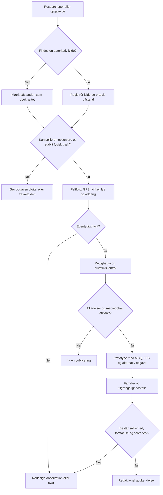

# Stedbundne observationsopgaver til familieappen

## Executive summary

De tre koncepter har forskellig produktmodenhed og bør ikke behandles som tre ensartede stedopgaver.

**Fjordenhus-opgaven er den historisk stærkeste, men også den mest kildekritisk følsomme.** Fjordenhus dokumenterer officielt, at bygningen rummer 13 farver uglaserede mursten og tre farver specialglaserede mursten. De officielle kilder dokumenterer derimod ikke, at en bestemt sten til venstre for gangbroen bærer Dronning Margrethe II’s initialer. Den oplysning kan findes i en privat rejsebeskrivelse, men uden angivet førstehåndskilde. Derfor kan appbrugeren højst bekræfte, at stenen og mærket findes; brugeren kan ikke ved observation alene bevise, hvem der har lavet mærket. Opgaven bør først formidle Margrethe-historien som et faktum, når Fjordenhus, KIRK KAPITAL eller Vejlemuseerne har bekræftet den skriftligt. citeturn1view2turn2search4turn8search2

**Børnehaveopgaven er bedst som en hybrid mellem stedobservation og digital søgeillustration.** Den officielle institution i Tirsbæk Bakker hedder **Tirsbækgård**, ikke Hirsbækgård, og ligger på Juulsbjergvej 30. Institutionens egen beskrivelse forbinder stedet med blandt andet heste, marker, skov og en sø, men de tilgængelige officielle tekster dokumenterer ikke, at en hest er institutionens officielle logo. Logoets udseende, offentlige synlighed og brugsrettigheder skal derfor bekræftes direkte med institutionen eller Vejle Kommune. citeturn1view0turn1view1turn9search0

**Fiskeopgaven er et robust visuelt minispil, men ikke i sig selv stedbundet.** Den bliver først en egentlig place-based-opgave, hvis illustrationen knyttes til en konkret sø, fiskebro eller lokal historie. Som billedopgave er den produktionsmæssigt den sikreste: fire fiskere, fire identiske snører, store entydige løkker og ét kanonisk facit — fiskeren nederst til højre i lilla trøje.

Målgruppens alder er ikke oplyst. Rapportens aldersangivelser er derfor testanbefalinger og ikke givne krav. Det anbefalede fælles udgangspunkt er cirka **7–12 år**, med en lettere variant til 5–7-årige og en mere kompakt tekstvariant til større børn.

| Opgave | Anbefalet produktstatus | Stedbundethed | Kanonisk facit | Vigtigste blokering |
|---|---|---:|---|---|
| Fjordenhus | Betinget prototype | Høj | Det synlige mærkes form, ikke ophavspersonen | Historien om Margrethe II er ikke officielt bekræftet |
| Tirsbækgård og minihesten | Prototype efter tilladelse | Middel til høj | Hest | Logo, adgang og rettigheder skal bekræftes |
| Fiskesnøren | Klar til illustrationsprototype | Lav uden konkret sted | Nederst til højre, lilla trøje | Linjetopologien skal være helt entydig |

Mockuppen ovenfor viser alene informationshierarki og løsningsmekanik. Den er ikke et færdigt løsningsbillede og må ikke bruges som produktionsmedie.

## Researchgrundlag, antagelser og beslutningskriterier

Den officielle dokumentation beskriver Fjordenhus som en 28 meter høj bygning af fire sammenhængende cylindre. Besøgende får adgang til den åbne stueetage via en smal gangbro, og Vejlemuseerne oplyser aktuelt offentlig adgang på egen hånd mandag–fredag kl. 08.00–21.30 og lørdag–søndag kl. 10.00–21.30. De guidede ture starter ved landgangsbroen, og en stor del af besøget foregår udendørs, hvor der kan være koldt og blæsende. citeturn2search12turn2search4

Fjordenhus’ egen murværksside er en stærk primærkilde til materialet: den beskriver 13 farver uglaserede og tre farver specialglaserede mursten, blå toner højere i buerne, grønne toner lavere samt individuelt formede sten i de hældende vægge. Kilden siger intet om en kongelig signatursten. citeturn1view2

Den eneste konkrete webkilde fundet i denne research, som forbinder Dronning Margrethe II med en mursten i Fjordenhus, er en privat rejseblog. Den skriver, at dronningen har sat sine initialer på én sten, men dokumenterer ikke oplysningens oprindelse med arkivmateriale, interview, pressemeddelelse eller officiel bygningsbeskrivelse. Den bør derfor behandles som et **researchspor**, ikke som dokumentation for facit. citeturn8search2

For institutionsopgaven er følgende antagelser styrende:

| Åbent punkt | Arbejdsantagelse | Krav før udgivelse |
|---|---|---|
| Institutionsnavn | “Hirsbækgård” antages at være en fejl for Tirsbækgård | Bekræft navn med opgaveejer |
| Logofil | Der er tidligere vist en visuel reference, men ingen rettighedsklar originalfil er leveret | Modtag SVG/PDF eller højopløst PNG fra rettighedshaveren |
| Hestens status | Hesten antages at være et officielt eller lokalt kendt symbol | Få skriftlig bekræftelse fra institutionen |
| Sandfarve | Ikke specificeret | Fastlægges i godkendt farvepalette og på kalibreret skærm |
| Aldersgruppe | Ikke specificeret | Gennemfør test i mindst to aldersgrupper |
| Stedets offentlige logo | Ikke online-verificeret | Kontrollér, at logoet kan ses fra et lovligt offentligt ståsted |
| Konkret sø til fiskeopgaven | Ikke angivet | Enten knyt opgaven til et sted eller mærk den som digital minigåde |

En stedopgave bør vurderes ud fra fire lag af bekræftelse:

| Lag | Hvad bekræftes? | Eksempel |
|---|---|---|
| Fysisk eksistens | Objektet kan faktisk ses fra det foreslåede ståsted | Den glaserede sten er synlig |
| Visuel aflæsning | Flere brugere aflæser det samme mærke eller dyr | Mærket ligner sammenhængende bogstaver |
| Proveniens | En autoritativ kilde forklarer objektets ophav | Museet bekræfter, hvem der mærkede stenen |
| Produktrobusthed | Opgaven virker under almindelige forhold | Facit er det samme i sol, overskyet vejr og på forskellige telefoner |

Kun de første to lag kan normalt løses af spillerens observation. Proveniens skal komme fra dokumentation, ikke fra et spørgsmål, der lægger svaret i munden på spilleren.

## Fjordenhus: den glaserede sten og det kongelige mærke

**Formål.** Spilleren skal lokalisere en særlig glaseret sten på muren til venstre for gangbroen og identificere det synlige mærkes type. Opgaven skal skabe opmærksomhed på Fjordenhus’ usædvanlige murværk uden at gøre en ubekræftet overlevering til et sikkert historisk faktum.

**Anbefalet målgruppe.** Alder er ikke oplyst. En foreløbig anbefaling er 8–14 år sammen med en voksen, fordi observationen foregår på afstand, stenen angiveligt sidder cirka fire meter over jorden, og mærket kan kræve målrettet visuel søgning. Der bør ikke kræves kraftig zoom eller meget skarpt syn for at gennemføre opgaven.

**Præcise observationskriterier.**

| Kriterium | Godkendelsesregel |
|---|---|
| Ståsted | Ét sikkert, offentligt ståområde skal gøre stenen synlig uden at blokere gangbroen |
| Placering | Stenen skal entydigt kunne beskrives som på muren til venstre for broen set fra det valgte ståsted |
| Højde | “Cirka fire meter” må kun bruges efter måling eller pålidelig bygningsoplysning |
| Materiale | Stenen skal visuelt skille sig ud som glaseret eller anderledes reflekterende |
| Mærke | Mærket skal kunne genkendes som samme kategori af mindst 80 % af testgrupperne |
| Lysrobusthed | Mærket skal være aflæseligt under mindst overskyet vejr og én almindelig solretning |
| Hjælpemiddel | Opgaven skal kunne løses med det blotte øje eller almindelig telefonzoom fra sikkert ståsted |
| Entydighed | Der må ikke være en anden nærliggende sten med et mærke, der kan vælges med samme rimelighed |

Fjordenhus’ materialebrug er officielt dokumenteret, men de skiftende refleksioner i specialglaseringen betyder, at synligheden af et lille mærke kan afhænge af vinkel og lys. Opgaven bør derfor ikke være afhængig af, at stenen “lyser op” i en bestemt solretning; en retningspil eller et verificeret referencefelt i appen kan blive nødvendigt. citeturn1view2turn2search12

**Anbefalet spørgsmålsform.**

> Kig på muren til venstre for gangbroen. Find den særlige glaserede sten med et mærke.  
> **Hvilken slags mærke kan I se på stenen?**

Det er bedre end spørgsmålet “Har Dronning Margrethe signeret stenen?”, fordi sidstnævnte blander fysisk observation og historisk ophav. En spiller kan se et mærke, men kan ikke ud fra udseendet bevise, hvem der lavede det.

**Foreløbig MCQ-design.** De endelige ord og distraktorer skal baseres på et skarpt feltfoto og blindtestes. Følgende er alene en model:

| Svarmulighed | Status | Designbemærkning |
|---|---:|---|
| Et mærke af sammenhængende bogstaver | Foreløbigt korrekt, hvis feltfoto bekræfter det | Brug ikke ordet “kongeligt” i svaret |
| En enkelt stjerne | Distraktor | Må ikke ligne en faktisk refleks eller skade |
| Et tydeligt årstal | Distraktor | Må kun bruges, hvis der ikke findes tal på stenen |
| En bølgeform uden bogstaver | Distraktor | Skal være visuelt plausibel, men forkert |

Hvis feltfotoet viser bestemte letlæselige tegn, er et stærkere spørgsmål: **“Hvilke tegn kan I se?”** Svarmulighederne kan da være konkrete tegnkombinationer. Det kræver, at mærket faktisk kan læses ensartet; ellers vil kategorien “bogstavmærke” være mere robust.

**Acceptable svarformater.** Ved single choice registreres kun én mulighed. Ved en eventuel tekstvariant bør systemet foreløbigt acceptere “monogram”, “initialer”, “bogstaver”, “bogstavmærke” og “sammenhængende bogstaver”, hvis feltverifikationen viser, at disse betegnelser beskriver samme observation. “Dronning Margrethe” bør ikke accepteres som svar på spørgsmålet om mærkets form.

**Text-to-speech-intro.**

> Fjordenhus er bygget af mursten, som ikke alle ser ens ud. Nogle er uglaserede, mens andre har blanke grønne og blå overflader, der spiller sammen med fjorden og lyset.  
>  
> På muren til venstre for gangbroen gemmer der sig en særlig sten med et lille mærke. Stå et sikkert sted, og kig højt op på muren. Kan I finde stenen og se, hvilken slags mærke den bærer?

Murværkets forskellige farver og specialglasering er officielt dokumenteret. citeturn1view2

**Feedback efter korrekt svar — før officiel bekræftelse.**

> **I fandt mærket.**  
> Den særlige sten bærer et mærke, der ligner sammenhængende bogstaver. Det fortælles, at mærket skulle være knyttet til Dronning Margrethe II, men den historie er endnu ikke bekræftet i de officielle kilder, vi har fundet. Det sikre er, at Fjordenhus rummer specialglaserede mursten, som er formet og placeret som en del af bygningens samlede kunstneriske murværk.

Den sidste sætning kan dokumenteres officielt; den kongelige tilskrivning skal stå som ubekræftet, indtil der foreligger et autoritativt svar. citeturn1view2turn8search2

**Feedback efter korrekt svar — efter skriftlig bekræftelse.**

> **I fandt den kongelige mursten.**  
> Mærket er Dronning Margrethe II’s initialer. Det er et lille personligt spor midt i Fjordenhus’ omfattende murværk af specialformede og glaserede sten.

Denne version må først bruges, når afsender, dato og ordlyd af museets eller ejerens bekræftelse er gemt i redaktionssystemet.

**Sikkerhed og tilgængelighed.** Fjordenhus ligger i vandet, stueetagen nås via en smal gangbro, og museet advarer om vind og kulde på havnen. Opgaven må ikke få familier til at standse midt på gangbroen, træde tæt på vandkanten, læne sig over rækværk eller gå bag afspærringer. Observationspunktet bør ligge på en bred, plan del af forpladsen eller anløbsområdet, hvis ejeren godkender det. Den offentlige adgang gælder den åbne stueetage; kælderen og øvrige dele har andre adgangsvilkår. citeturn2search4turn2search12

For brugere med nedsat syn bør opgaven have en alternativ gennemførelsesvej. Et fuldt beskrivende alt-tekstfelt vil afsløre billedsvaret og er derfor ikke en tilstrækkelig løsning alene. Appen bør tilbyde en alternativ, ikke-visuel arkitektur- eller materialegåde med samme pointværdi. Digitaliseringsstyrelsen fremhæver, at meningsbærende billeder skal have funktionelle tekstalternativer, og at visuel information skal kunne tilbydes i et andet format. citeturn3search10turn3search2

**Feltverifikation.**

| Trin | Dokumentation | Beståelseskriterium |
|---|---|---|
| Stedets identitet | Oversigtsfoto af Fjordenhus, bro og venstre mur | Muren kan orienteres uden tvivl |
| GPS | Position for sikkert ståsted, ikke for selve stenen | Gentagelig placering med almindelig telefon |
| Ståretning | Kompasretning og foto fra øjenhøjde | En ny tester kan stille sig samme sted |
| Afstand | Målt eller forsvarligt estimeret afstand til mur | Angives i opgaveinstruksen, hvis nødvendigt |
| Højde | Måling, bygningsdata eller udeladt højdeangivelse | “Fire meter” bruges kun, hvis verificeret |
| Oversigtsfoto | 1× kamera uden digital zoom | Stenens område kan markeres |
| Mellemfoto | Moderat optisk zoom | Stenen kan skelnes fra nabosten |
| Nærfoto | Maksimal legitim optisk zoom fra ståstedet | Mærket kan vurderes redaktionelt |
| Vinkler | Mindst tre sideforskudte positioner | Bedste vinkel kan beskrives |
| Lys | Overskyet samt mindst én solretning | Opgaven er ikke afhængig af ét lysøjeblik |
| Trafikflow | Observation af gangbro og besøgsstrøm | Familien kan stå uden at blokere |
| Blindtest | Testpersoner uden forhåndsviden | De finder samme sten og beskriver samme mærke |

**Forslag til faktatjekmail til Vejlemuseerne.**

> **Emne: Faktatjek om mærket mursten ved Fjordenhus**  
>  
> Kære Vejlemuseerne  
>  
> Vi udvikler en familievenlig observationsopgave om Fjordenhus. Fra et offentligt ståsted ved gangbroen kan man efter vores oplysninger se en særlig glaseret mursten på muren til venstre for broen, omtrent fire meter over jorden. Stenen ser ud til at bære et mærke eller nogle initialer.  
>  
> En uofficiel webkilde hævder, at mærket er lavet af Dronning Margrethe II. Kan I hjælpe os med at bekræfte eller afkræfte følgende:  
>  
> 1. Om den beskrevne sten og placering er korrekt.  
> 2. Hvad mærket forestiller.  
> 3. Hvem der har lavet mærket, og i hvilken forbindelse.  
> 4. Om oplysningerne må gengives i en kommerciel familieapp med kildehenvisning.  
> 5. Om der er et anbefalet offentligt og sikkert observationssted.  
>  
> Vi sender gerne vores feltfoto med markering af stenen. Vi offentliggør ikke historien som faktum, før den er bekræftet.  
>  
> Venlig hilsen  
> Byens Hemmeligheder

Vejlemuseerne står for den officielle formidling og guidede ture i Fjordenhus og oplyser en offentlig museumsadresse og kontaktkanal på deres hjemmeside. citeturn2search4turn1view3

## Tirsbækgård: logoet og den camouflerede minihest

Den officielle institution hedder Tirsbækgård og ligger på Juulsbjergvej 30, 7120 Vejle Øst. Institutionens officielle profil lægger vægt på natur og bæredygtighed og oplyser, at der fra legepladsen er udsigt til blandt andet heste, marker, skov og en lille sø. Det giver en lokal, men endnu ikke logo-specifik, begrundelse for hestemotivet. citeturn1view0turn1view1

**Formål.** Familien skal først observere, hvilket dyr institutionens godkendte logo viser. Derefter skal den finde samme dyr som den eneste levende dyrefigur i en tætbefolket søgeillustration. Hesten skal være en realistisk minihest, der står i en sandkasse og næsten har samme farve som sandet.

**Anbefalet målgruppe.** Alder er ikke oplyst. Foreløbig anbefaling er 5–10 år. Børn på 4–6 år er mere påvirkelige af visuel crowding end ældre børn, og tætliggende elementer kan gøre genkendelse væsentligt sværere. Søgefeltets tæthed og hestens størrelse bør derfor have mindst en lettere variant. citeturn7search0turn7search6

**Stedbundet opgaveflow.**

| Fase | Spillerhandling | Kontrol |
|---|---|---|
| Stedobservation | Se på institutionens skilt eller facade fra offentligt ståsted | Hvilket dyr vises i logoet? |
| Hukommelsesbro | Appen viser ikke logoet igen, men fortæller at dyret har gemt sig | Spilleren overfører observationen til billedet |
| Søgeillustration | Find det eneste dyr blandt børn, legetøj og legepladsobjekter | Tryk på hesten eller besvar MCQ |
| Bekræftelse | Vælg dyrets navn | Hest |
| Lokal feedback | Knyt motivet til stedet uden at opfinde en logohistorie | Institutionens omgivelser har heste og natur |

Hvis logoet ikke er synligt fra et lovligt offentligt ståsted, må opgaven ikke sende familier ind på institutionens legeplads eller hen til vinduer og indgang. I så fald skal logoobservationen erstattes af et godkendt billede i appen, og opgaven bliver en digital lokalopgave frem for en ren stedobservation.

**Præcise observationskriterier.**

| Kriterium | Godkendelsesregel |
|---|---|
| Antal dyr | Der findes præcis ét visuelt fortolkeligt dyr i hele illustrationens billedfelt |
| Dyreart | Det eneste dyr er en hest, udformet som realistisk minihest |
| Placering | Hesten står med alle fire ben i eller ved sandkassens sandflade |
| Camouflage | Hest og sand bruger samme grundtone og næsten samme lyshed |
| Genkendelighed | Hestens hoved, mule, ører, manke, fire ben og hesteproportioner kan identificeres |
| Ingen skjulte dyr | Ingen bamser, dyretryk, ballondyr, dyreskyer, skulpturer eller tøjdyr må ligne dyr |
| Mennesker | Alle øvrige levende figurer er mennesker |
| Stil | Børn og miljø tegnes barnligt og legende; hesten er mere naturtro, men harmonerer med stregen |
| Logooverførsel | Godkendte særtræk fra logoets hest bevares, hvis rettighedshaveren kræver det |
| Entydighed | En tester må ikke med rimelighed kunne svare “æsel”, “ged” eller “hund” |

Formuleringen “i stil med Find Holger” bør omsættes til **“en tæt, humoristisk seek-and-find-illustration”**. Designeren bør ikke kopiere figurer, kompositioner, typografi eller andre karakteristiske elementer fra en bestemt bogserie. Brug af andres billeder og grafiske værker i en app kræver som udgangspunkt rettighedsafklaring, og et navn eller logo kan desuden være varemærkebeskyttet. citeturn4search0turn4search4

**Anbefalet spørgsmål.**

> Se godt på den travle legeplads. Der gemmer sig præcis ét dyr i hele billedet.  
> **Hvilket dyr står i sandkassen?**

**MCQ-muligheder.**

| Mulighed | Status | Kommentar |
|---|---:|---|
| Hest | Korrekt | Brug institutionens foretrukne betegnelse |
| Hund | Distraktor | Anatomisk tydeligt forkert |
| Ged | Distraktor | Plausibel nok til at kræve observation |
| Kanin | Distraktor | Let genkendelig alternativ dyreart |

“Pony” bør ikke bruges som distraktor, fordi en realistisk minihest af mange vil blive omtalt som en pony. Hvis fritekst anvendes, bør acceptable svar være **hest**, **en hest**, **minihest** og **mini-hest**. “Pony” kan enten accepteres som et tolerant synonym eller udløse en hjælpsom nærved-feedback; valget skal afgøres redaktionelt efter illustrationens faktiske udseende.

**Nærved-feedback.**

> **Pony:** Du har fundet det rigtige sted og et hestelignende dyr. I denne opgave bruger vi navnet *hest*, fordi figuren er lavet efter institutionens hestesymbol.

**Text-to-speech-intro.**

> Ved Tirsbækgård har et dyr fået en særlig plads. Kig først på institutionens skilt eller logo fra det anviste offentlige sted. Læg mærke til, hvilket dyr I ser.  
>  
> Nu er dyret stukket af fra logoet og har gemt sig i en travl tegning fyldt med børn, legetøj og ting fra legepladsen. Der er kun ét dyr i hele billedet. Kan I finde det?

Denne tekst må først sige “logo”, når institutionen har bekræftet, at hesten faktisk er det officielle symbol, og at skiltet må indgå i opgaven.

**Feedback efter korrekt svar.**

> **I fandt minihesten.**  
> Den stod næsten skjult i sandkassen, fordi dens pels havde næsten samme farve som sandet. Hesten fører tilbage til symbolet, I observerede ved Tirsbækgård. Institutionen beskriver selv naturen omkring huset som en vigtig del af børnenes hverdag, med udsigt til blandt andet heste, marker, skov og en lille sø.

Den sidste historiske eller lokale forklaring er dokumenteret af institutionen; en påstand om logoets oprindelse må ikke tilføjes uden særskilt dokumentation. citeturn1view1

**Illustrationsspecifikation.**

| Parameter | Produktionskrav |
|---|---|
| Format | Liggende 4:3 eller kvadratisk, afhængigt af appens billedkomponent |
| Master | Lagdelt SVG, AI eller Figma-fil; alternativt minimum 4000 px på længste led |
| App-eksport | WebP eller AVIF ved 2048 px længste led; PNG-reference til kvalitetstjek |
| Antal mennesker | Cirka 18–30 børn og voksne, justeret efter mobiltest |
| Antal dyr | Præcis 1 |
| Hestestørrelse | Cirka 5–8 % af billedets bredde ved baselineversion |
| Hestestil | Realistisk minihest med forenklet, børnevenlig streg |
| Miljøstil | Håndtegnet, let ujævn og barnlig, men ikke så kaotisk at objekter smelter sammen |
| Sandfarve | Endelig farve fastsættes efter godkendt palette |
| Hestefarve | Samme grundfarve som sandet; foreløbig højst cirka 6 procentpoint forskel i lyshed |
| Kontur | Diskret kontur, som bevarer genkendeligheden ved mobilskalering |
| Skjulemekanik | Farvelighed og billedtæthed, ikke beskæring eller manglende kropsdele |
| Forbudte elementer | Ingen dyrefigurer på tøj, legetøj, flag, vægmalerier, skyer eller skilte |
| Facitlag | Separat skjult lag med hestens omrids og koordinater til QA |
| Tapområde | Klikområdet omkring hesten bør være større end selve figuren uden at overlappe andre mål |

Camouflage må ikke være den eneste mekanisme, der formidler betydning. W3C anbefaler, at farve ikke bruges som eneste middel til at skelne information, fordi brugere opfatter farver forskelligt. Her skal hestens kontur, anatomi og placering derfor fortsat være aflæselig, selv om farven ligger tæt på sandets. citeturn6search0turn3search0

**Sikkerhed, privatliv og adgang.** En daginstitution er et særligt følsomt miljø. Der bør ikke tages produktionsfotos, mens identificerbare børn er i billedet, og opgaven må ikke instruere spillere i at fotografere børn, kigge ind på legepladsen eller opholde sig ved indgangen. Tirsbækgårds officielle side dokumenterer adressen og institutionens funktion, men ikke at legepladsen er offentligt tilgængelig. Den omtaler et tilknyttet fælleshus, som beboere kan benytte uden for institutionens åbningstid; det er ikke det samme som offentlig adgang til børnehavens område. citeturn1view0turn1view1

Datatilsynet understreger, at offentliggørelse af billeder med identificerbare personer kræver et behandlingsgrundlag og en konkret helhedsvurdering, og at børn nyder særlig beskyttelse. For skoler og daginstitutioner er samtykke til én aktivitet ikke automatisk samtykke til offentliggørelse af billeder; formålene skal holdes adskilt. citeturn4search1turn5search16turn3search17

**Logo- og illustrationsrettigheder.** Et logo kan være ophavsretligt beskyttet og kan fungere som varemærke. En ny realistisk hest, der tydeligt er afledt af logoets figur, bør derfor ikke bestilles eller publiceres som officiel logofigur uden skriftlig tilladelse. Patent- og Varemærkestyrelsen anbefaler udtrykkeligt, at appudviklere indhenter tilladelse til brug af andres tekst, lyd og billeder. citeturn4search0turn4search4

Tilladelsen bør dække:

| Rettighed | Formulering, der skal afklares |
|---|---|
| Originalt logo | Må logoet fotograferes og vises i appen? |
| Bearbejdelse | Må hesten omtegnes som realistisk minihest? |
| Kommerciel brug | Må materialet indgå i en betalt eller sponsoreret app? |
| Platforme | Må det bruges i app, web, sociale medier og markedsføring? |
| Varighed | Er tilladelsen tidsubegrænset eller tidsbegrænset? |
| Geografi | Gælder den kun Danmark eller alle appmarkeder? |
| Kreditering | Skal Vejle Kommune, institutionen eller designeren krediteres? |
| Godkendelse | Skal institutionen godkende den endelige illustration? |

**Felt- og rettighedscheck.**

| Trin | Dokumentation | Godkendelseskrav |
|---|---|---|
| Navn | Foto og officiel webside | Tirsbækgård er korrekt navn |
| Logo | Foto fra offentligt sted | Hesten kan ses uden privat adgang |
| Facit | Nærfoto af logo | Dyret er entydigt en hest |
| Ståsted | GPS og oversigtsfoto | Ingen blokering af indgang |
| Børn/personale | Produktionsfoto uden identificerbare personer | Ingen efterfølgende anonymisering nødvendig |
| Tilladelse | Mail eller kontrakt | Logo og bearbejdelse er dækket |
| Originalfil | SVG/PDF/PNG fra rettighedshaver | Filens ophav og version er dokumenteret |
| Sandfarve | Godkendt farvekode | Samme på master og eksport |
| Dyreoptælling | Manuel QA ved 100 %, 50 % og thumbnail | Præcis ét dyr i alle størrelser |
| Blindtest | Test uden at nævne sandkassen først | Flertallet finder hesten uden gætteri |

## Fiskesnøren: fire fiskere og ét entydigt spor

**Formål.** Spilleren følger én sammenhængende fiskesnøre fra fisken gennem store løkker til den korrekte fisker. Alle snører skal have nøjagtig samme farve og stregtykkelse, så løsningen afhænger af visuel sporing og ikke farvekodning.

**Stedbundethed.** Uden en konkret sø, lokal fisketradition eller fysisk observation er dette et digitalt billedpuslespil. Det kan fungere som bonusopgave, overgang eller belønning i en lokal mission. Skal det være en egentlig stedopgave, bør spillerne først observere et stabilt træk ved en bestemt sø — eksempelvis antal faste fiskeplatforme — hvorefter observationen bruges til at låse billedgåden op.

**Anbefalet målgruppe.** Alder er ikke angivet. Foreløbig anbefaling er 6–12 år. En lettere udgave kan have kortere snører og færre retningsskift; en sværere udgave kan have længere ruter, men må ikke introducere tvetydige sammenfletninger.

**Kanonisk facit.**

> **Fiskeren nederst til højre med den lilla trøje.**

**Præcise observationskriterier.**

| Kriterium | Godkendelsesregel |
|---|---|
| Personer | Præcis fire fiskere |
| Placering | Fiskerne står tydeligt forskellige steder langs bredden |
| Fisk | Præcis én facitbærende fisk |
| Snører | Fire separate snører med identisk RGB/HEX-værdi og identisk tykkelse |
| Start | Hver snøre starter synligt ved spidsen af én fiskestang |
| Slut | Kun den korrekte snøre ender ved fiskens mund eller krog |
| Facitperson | Nederst til højre, lilla trøje |
| Løkker | Hovedløkker skal være store nok til at følges uden mikroskopiske vendinger |
| Sammenløb | Ingen snører må dele et segment eller røre hinanden |
| Krydsninger | Helst ingen; hvis de bruges, skal en konsekvent bro-/gapsymbolik vise kontinuitet |
| Baggrund | Ingen siv, grene eller bølger må ligne snørerne |
| Beskæring | Ingen snøre må forsvinde ud af billedet eller bag en figur |
| Mobilitet | Hele ruten skal kunne følges ved almindelig visning uden obligatorisk pinch-zoom |

Store løkker bør mindst optage cirka 12–15 % af billedets bredde eller højde. Det er en foreslået intern produktionsregel, som skal valideres i test, ikke en universel standard.

**Anbefalet spørgsmål.**

> Følg snøren fra fisken hele vejen tilbage til fiskestangen. Alle snørerne har samme farve.  
> **Hvilken fisker har fanget fisken?**

**MCQ-design.**

| Svar | Status |
|---|---:|
| Øverst til venstre — rød trøje | Forkert |
| Midt til venstre — blå trøje | Forkert |
| Øverst til højre — grøn trøje | Forkert |
| Nederst til højre — lilla trøje | Korrekt |

Svarene bør indeholde både **placering og trøjefarve**. Farve må ikke være den eneste informationsbærer, da ikke alle brugere skelner farver ens. citeturn6search0

**Acceptable svarformater.** Ved single choice er den fjerde mulighed korrekt. Ved tale- eller fritekstsvar bør følgende accepteres:

| Accepteret | Bemærkning |
|---|---|
| lilla | Kun hvis stemmeinput forventes at give korte svar |
| den lilla | Almindelig talesprog |
| lilla trøje | Entydigt |
| nederst til højre | Entydigt, hvis layoutet er låst |
| personen nederst til højre | Entydigt |
| fisker fire | Kun hvis personerne også er nummereret visuelt |
| kvinden/manden i lilla | Bør undgås som nødvendigt facit, da kønsudtryk kan aflæses forskelligt |

**Text-to-speech-intro.**

> Fire personer fisker langs søens bred. Et sted i vandet hænger en fisk på én af snørerne.  
>  
> Alle snørerne har præcis samme farve, så farven kan ikke hjælpe jer. Start ved fisken, og følg snøren langsomt gennem de store løkker. Hvilken fiskestang ender den ved?

**Feedback efter korrekt svar.**

> **Rigtigt — fiskeren nederst til højre har fanget fisken.**  
> Snøren går fra fisken gennem de store løkker og ender ved fiskestangen hos personen med den lilla trøje. De andre snører stopper andre steder og er kun vildspor.

**Illustrationsspecifikation.**

| Parameter | Krav |
|---|---|
| Masterformat | SVG eller lagdelt Figma/AI |
| Rastermaster | Minimum 4000 × 3000 px, hvis vektor ikke er mulig |
| App-eksport | WebP/AVIF 2048 × 1536 samt 1280 × 960 fallback |
| Referenceeksport | Tabsfri PNG til QA |
| Linjefarve | Én fælles mørk neutral farve, eksempelvis `#3F4448` |
| Linjetykkelse | Samme tykkelse på alle fire snører; cirka 5–7 px i 2048 px-eksporten |
| Linjeafstand | Mindst cirka 10–12 px ved nærpassager i 2048 px-eksporten |
| Krydsninger | Ingen som standard; alternativt tydelig broeffekt med fast regel |
| Fiskertrøjer | Fire tydeligt forskellige trøjer; korrekt fisker er lilla |
| Facitposition | Nederst til højre og låst i alle beskæringer |
| Løkker | Store, afrundede kurver uden små knæk |
| Slutmarkering | Krog eller linekontakt ved fisk skal være synlig |
| QA-lag | Nummererede snører og facitrute i skjult designerlag |
| Thumbnailtest | Facit må ikke kunne gættes blot ud fra linjelængden i miniature |

Linjerne skal have tilstrækkelig kontrast mod vand, bred og figurer. Digitaliseringsstyrelsen beskriver kontrast som væsentlig for betydningsbærende grafik og aktive komponenter. citeturn3search0

**Tilgængelig alternativ opgave.** En skærmlæsertekst, der beskriver ruten og dermed afslører facit, er ikke en reel tilsvarende spiloplevelse. Appen bør i stedet tilbyde en alternativ lydlogikopgave, eksempelvis fire korte lydspor med retningsord, hvor brugeren følger samme princip og når til “nederst til højre”. Billedet skal stadig have en kort funktionel alt-tekst, eksempelvis: “Visuel opgave med fire fiskere og sammenfiltrede fiskesnører; en alternativ lydopgave er tilgængelig.” Digitaliseringsstyrelsen anbefaler funktionelle tekstalternativer og alternative formater for information, der ellers kun er visuel. citeturn3search10turn3search2

## Fælles produktions-, tilgængeligheds- og retskrav

**Sammenligning af designleverancer.**

| Leverance | Fjordenhus | Tirsbækgård | Fiskesnøre |
|---|---|---|---|
| Primær feltfoto | Ja, afgørende | Ja, af logo og ståsted | Kun hvis knyttet til konkret sø |
| Historisk faktatjek | Ja, hos museum/ejer | Ja, om logoets status og ophav | Kun ved lokal historie |
| Rettighedstilladelse | Foto- og husregler bør afklares | Ja, udtrykkeligt for logo og bearbejdelse | Designer-/illustratøraftale |
| Original illustration | Eventuelt hjælpekort | Ja, hovedmedie | Ja, hovedmedie |
| Facitoverlay | Markering af stenens position | Hestens omrids og koordinat | Korrekt snørerute |
| Alternativ til synsopgave | Ja | Ja | Ja |
| TTS-intro | Ja | Ja | Ja |
| MCQ | Bør bruges | Bør bruges | Bør bruges |
| Felttest | To lysforhold og besøgsflow | Offentligt ståsted og privatliv | Kun ved konkret sted |
| Skærmtest | Zoom og genskin | Søgbarhed og camouflage | Linjekontinuitet |

**Fælles mediespecifikation.**

| Element | Minimum | Anbefalet |
|---|---:|---:|
| Masterens lange side | 3000 px | 4000–5000 px eller vektor |
| Appens store eksport | 1600 px | 2048 px |
| Mindre fallback | 960 px | 1280 px |
| Illustration med fine linjer | PNG/WebP lossless | SVG, hvis platformen understøtter det sikkert |
| Foto | WebP/AVIF med moderat kompression | Gem original RAW/JPEG separat |
| Farverum | sRGB | sRGB med kontrolleret eksport |
| Beskæring | Én låst hovedversion | Særskilte mobil- og tabletversioner |
| Metadata | Titel, ophav, dato og rettigheder | Versionsnummer og facitkoordinater |

**Svarflader.** WCAG 2.2 angiver mindst 24 × 24 CSS-pixels for pointermål eller tilstrækkelig afstand mellem små mål. Til en familieapp bør MCQ-knapper i praksis være større, eksempelvis mindst 44–48 CSS-pixels høje, med tydelig afstand, fordi appen bruges på touchskærme og ofte udendørs. Det større mål er en produktanbefaling; 24 × 24 er standardens minimumskriterium. citeturn6search1turn6search2

**Kontrast og camouflage.** Brødtekst og små labels bør opfylde mindst 4,5:1-kontrast, mens stor tekst kan anvende 3:1 efter de relevante størrelsesgrænser. Betydningsbærende grafik og kontroller skal ligeledes kunne adskilles tilstrækkeligt. Selve minihesten må gerne være camoufleret som opgavemekanik, men instruktion, knapper, fokusmarkering og feedback må ikke være lavkontrast. citeturn3search0

**Fotografering og personer.** Straffelovens § 264 a forbyder uberettiget fotografering af personer, der befinder sig på et ikke frit tilgængeligt sted. Det er særligt relevant ved en daginstitution og ved fotografering mod kontorer eller private områder. Produktionsfotografer bør holde kameraet mod det relevante bygningsobjekt, undgå identificerbare børn og medarbejdere og indhente særskilt tilladelse, hvis personer skal medvirke. citeturn5search5

Offentliggørelse af identificerbare personer er desuden behandling af personoplysninger og kræver en konkret vurdering af formål og behandlingsgrundlag. Datatilsynet har forladt en enkel opdeling mellem situations- og portrætbilleder til fordel for en helhedsvurdering, og børn har krav på særlig beskyttelse. citeturn4search1turn3search17

**Fjordenhus og arkitekturfoto.** Den danske ophavsretslov fastslår, at bygninger frit må afbildes. Det betyder dog ikke, at alle praktiske spørgsmål er løst: adgangsvilkår, fotografering på privat område, særskilte kunstværker, personer i billedet og brug af ejerens egne fotografier skal vurderes separat. Et selvtaget foto af bygningens murværk fra lovligt ståsted er rettighedsmæssigt noget andet end at kopiere et foto fra Fjordenhus’ hjemmeside. citeturn10search0turn3search5

**Logoet.** Ophavsretten giver som udgangspunkt ophaveren eneret til eksemplarfremstilling og offentlig tilgængeliggørelse, også i ændret form. At omtegne en logohest som en realistisk minihest fjerner derfor ikke automatisk behovet for tilladelse. citeturn5search13turn4search0

**Designeraftalen** bør overdrage eller licensere appudvikleren rettigheder til illustrationerne, herunder beskæring, animation, lokalisering, tilgængelighedsbearbejdning, markedsføring og fremtidige opløsninger. Den bør også dokumentere, at designeren ikke har kopieret beskyttede figurer eller billeder.

## Feltverifikation, usabilitytest og beslutningsflow

**Samlet fotocheckliste.**

| Foto/data | Fjordenhus | Tirsbækgård | Konkret sø til fiskeopgave |
|---|---:|---:|---:|
| GPS for sikkert ståsted | Ja | Ja | Ja |
| Kompasretning | Ja | Ja | Ja |
| Oversigt uden zoom | Ja | Ja | Ja |
| Mellemfoto | Ja | Ja | Eventuelt |
| Nærfoto | Ja, af sten | Ja, af logo | Af lokalt observationselement |
| Flere sidevinkler | Mindst 3 | Mindst 2 | Efter behov |
| Overskyet lys | Ja | Ja | Ja |
| Sollys/modlys | Ja | Ja | Ja |
| Aften/mørke | Kun hvis opgaven skal kunne spilles da | Nej som standard | Kun ved relevant åbningstid |
| Bystandere fjernet | Ja | Særligt vigtigt | Ja |
| Adgangsskiltning | Ja | Ja | Ja |
| Vandkant/risiko | Ja | Ikke primært | Ja |
| Kørestols-/barnevognsrute | Ja | Ja | Ja |
| Skærmbillede ved ståsted | Ja | Ja | Ja |
| Notat om zoombehov | Ja | Ja | Ikke relevant for illustration |
| Rettighedslog | Ja | Ja | Ja |

**Testgrupper.** Alder er ikke fastlagt. En effektiv første test kan gennemføres i tre grupper: 5–7 år med voksen, 8–10 år og 11–14 år. Hver iterativ runde bør omfatte mindst 6–8 familier eller børn pr. relevant gruppe. Dette er en projektanbefaling, ikke en formel standard.

**Pass/fail-protokol.**

| Testparameter | Fjordenhus | Tirsbækgård | Fiskesnøren |
|---|---|---|---|
| Tid til første korrekte observation | Helst under 90 sekunder | 10–60 sekunder | 15–75 sekunder |
| Korrekt uden hint | Mindst 70 % | 60–85 % afhængigt af alder | Mindst 80 % |
| Korrekt efter ét hint | Mindst 90 % | Mindst 90 % | Mindst 95 % |
| Fejl på grund af ordlyd | Højst 10 % | Højst 10 % | Højst 5 % |
| To plausible facitter | Automatisk afvisning | Automatisk afvisning | Automatisk afvisning |
| Behov for farveskel alene | Ikke relevant | Afvisning eller redesign | Afvisning |
| Kræver farlig placering | Automatisk afvisning | Automatisk afvisning | Automatisk afvisning |
| Kræver indtrængen på privat område | Automatisk afvisning | Automatisk afvisning | Automatisk afvisning |
| Løses kun i bestemt sollys | Redesign | Redesign | Ikke relevant |
| Fungerer ved 200 % zoom | Skal kontrolleres | Skal kontrolleres | Skal kontrolleres |
| Fungerer i stærkt udendørs genskin | Skal kontrolleres | Skal kontrolleres | Skal kontrolleres |

Tids- og succesintervallerne er foreslåede interne acceptmål. De skal justeres efter appens overordnede sværhedsgrad og den endelige målgruppe.

**Specifik usabilitytest af Fjordenhus.** Testpersonen skal uden at kende Margrethe-historien kunne pege på den samme sten og beskrive mærket. Efter testen spørges: “Hvad kunne du selv se, og hvad fortalte appen dig?” Hvis testpersonen svarer, at vedkommende “så, at dronningen havde signeret”, har teksten blandet observation og historie for meget.

**Specifik usabilitytest af minihesten.** Efter søgningen skal testeren først pege på dyret og dernæst oplyse, om andre dele af billedet også lignede dyr. Enhver bamse, dyreformet gynge, fugl på himlen eller figur på tøj tæller som brud på kravet om præcis ét dyr. Testen skal gennemføres både på stor telefon, lille telefon og med gråtonefilter. Gråtonefilteret skal ikke nødvendigvis gøre opgaven let, men hestens form skal stadig kunne identificeres.

**Specifik usabilitytest af fiskesnøren.** Designeren leverer et facitkort med fire nummererede vektorbaner. En uafhængig reviewer følger hver snøre fra begge retninger. Hvis en bane rører en anden, deler pixels, forsvinder bag et objekt eller ser ud til at skifte bane i en krydsning, afvises illustrationen. Der udføres desuden en pixelkontrol, som bekræfter, at alle fire snører har identisk farve og tykkelse.

**Endelige beslutningsporte.**

| Opgave | Skal være opfyldt før produktionsgodkendelse |
|---|---|
| Fjordenhus | Sten og mærke feltverificeret; sikkert ståsted dokumenteret; Margrethe-påstanden officielt bekræftet eller konsekvent mærket som ubekræftet; aktuelle adgangsforhold kontrolleret |
| Tirsbækgård | Korrekt institutionsnavn; hestelogo bekræftet; logo synligt fra lovligt sted; skriftlig tilladelse til logo og bearbejdelse; ingen fotografering af børn; præcis ét dyr i illustrationen |
| Fiskesnøren | Fire identiske snører; store løkker; ingen tvetydige krydsninger; korrekt rute ender nederst til højre; svarmuligheder bruger både position og farve; ikke-visuel alternativ opgave implementeret |

Den anbefalede rækkefølge er derfor: producer først fiskesnørens tekniske prototype, indhent dernæst Tirsbækgårds logo- og adgangstilladelse, og gennemfør til sidst Fjordenhus’ feltverifikation og museumsfaktatjek. Fjordenhus-opgaven har størst fortællekraft, men må ikke få en stærkere historisk formulering, end kilderne kan bære.